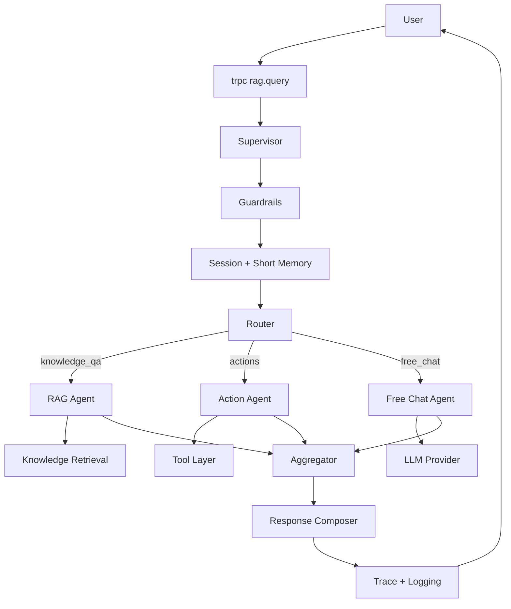

# Agent Architecture Blueprint (Node.js Production)

Tai lieu nay tong hop de xuat kien truc agent theo mo hinh:
Supervisor -> Planner/Router -> cac agent chuyen trach -> Aggregator -> Response Composer.

## 1) Hien trang vs muc tieu

### Hien trang trong project

- API Gateway: `apps/server/src/controllers/trpc/ragRouter.ts`
- Supervisor (dang all-in-one): `apps/server/src/lib/ai/orchestration/answerWithRag.ts`
- Router/Intent: `apps/server/src/lib/ai/intent/classifyUserIntent.ts`
- RAG retrieval: `apps/server/src/lib/ai/retrieval/knowledgeBase.ts`
- Action tools: `apps/server/src/lib/ai/tools/*`
- Memory ngan han: `apps/server/src/lib/ai/memory/shortMemory.ts`
- Guardrails: `apps/server/src/lib/ai/guardrails/index.ts`
- Logging: `apps/server/src/lib/ai/logging/aiLogger.ts`

### Muc tieu

- Tach ro trach nhiem Supervisor / Router / Agent / Tool.
- Giu backward compatibility cho API hien tai (`answerWithRag`, `rag.query`).
- San sang mo rong them SQL Agent, Dashboard Agent, Search Agent.

## 2) Cau truc thu muc de xuat (incremental)

```text
apps/server/src/lib/ai/
├── core/
│   ├── types.ts
│   ├── config.ts
│   └── trace.ts
├── services/
│   ├── llm/
│   │   ├── callProvider.ts
│   │   └── classifyIntent.ts
│   ├── memory/
│   │   └── shortMemory.ts
│   └── session/
│       └── sessionManager.ts
├── agents/
│   ├── supervisor/
│   │   └── runSupervisor.ts
│   ├── router/
│   │   └── routeIntent.ts
│   ├── rag/
│   │   └── ragAgent.ts
│   ├── actions/          # agent orchestrator (runActionAgent)
│   │   └── runActionAgent.ts
│   ├── sql/          (phase 2)
│   ├── dashboard/    (phase 2)
│   └── search/       (phase 3)
├── tools/
│   ├── detectTool.ts
│   ├── types.ts
│   ├── index.ts
│   └── buildDemo/
│       ├── buildDemoTool.ts
│       ├── buildDemoExecutor.ts
│       └── ...
├── workflows/
│   ├── chatFlow.ts
│   ├── ragFlow.ts
│   └── actionFlow.ts
├── orchestration/
│   ├── aggregator.ts
│   ├── responseComposer.ts
│   └── answerWithRag.ts  (giu wrapper API cu)
├── guardrails/
├── logging/
└── prompts/
```

## 3) Contracts can co (TypeScript)

Can bo sung cac type chung:

- `AgentName`: `rag | actions | free_chat | sql | dashboard | search`
- `AgentContext`: chua `requestId`, `question`, `provider`, `session`, `history`, `attachments`, `role`, `email`.
- `RouteDecision`: `intent`, `agent`, `confidence`, `reason`, `source`.
- `AgentResult`: ket qua chuan hoa cho moi agent (`answer`, `confidence`, `sources`, `toolCalled`, `fallbackUsed`, `spans`).
- `SupervisorResult`: response tong hop + trace.

Muc tieu la tat ca node (router/agents/tools/aggregator) giao tiep cung schema de de log va mo rong.

### Vi du code: `apps/server/src/lib/ai/core/types.ts`

```ts
export type ChatProvider = "gemini" | "openai";
export type Intent = "knowledge_qa" | "free_chat" | "actions";

export type AgentName =
  | "rag"
  | "actions"
  | "free_chat"
  | "sql"
  | "dashboard"
  | "search";

export type MemoryMessage = {
  role: "user" | "assistant";
  content: string;
};

export type ChatAttachmentMeta = {
  name: string;
  relativePath?: string;
  size: number;
  mimeType?: string;
  contentBase64?: string;
  encoding?: "base64";
};

export type AgentContext = {
  requestId: string;
  question: string;
  provider: ChatProvider;
  role: string;
  email?: string;
  sessionId?: string;
  memoryKey: string;
  history: MemoryMessage[];
  attachments: ChatAttachmentMeta[];
};

export type RouteDecision = {
  intent: Intent;
  agent: AgentName;
  confidence: number;
  reason: string;
  source: "rule_tool" | "llm" | "rule_fallback";
};

export type AgentTraceSpan = {
  agent: AgentName;
  startedAt: number;
  endedAt: number;
  ok: boolean;
  confidence?: number;
  reason?: string;
  toolCalled?: string;
  sources?: string[];
  error?: string;
};

export type AgentResult = {
  ok: boolean;
  agent: AgentName;
  answer: string;
  confidence: number;
  sources: string[];
  toolCalled?: string;
  buildDemoProcessing?: boolean;
  fallbackUsed?: boolean;
  spans: AgentTraceSpan[];
  metadata?: Record<string, unknown>;
};

export type SupervisorResult = {
  ok: true;
  answer: string;
  provider: ChatProvider;
  intent: Intent;
  agent: AgentName;
  sources: string[];
  fallbackUsed: boolean;
  toolCalled?: string;
  buildDemoProcessing?: boolean;
  trace: {
    requestId: string;
    route: RouteDecision;
    spans: AgentTraceSpan[];
    totalMs: number;
  };
};
```

## 4) Luong xu ly de xuat



## 5) Refactor strategy khong pha API

- Giu nguyen export `answerWithRag(input)`.
- Chuyen logic trong `answerWithRag.ts` sang `runSupervisor.ts`.
- `answerWithRag.ts` tro thanh wrapper mapping `SupervisorResult` -> `RagAnswerResult`.
- `ragRouter.query` khong can doi contract voi frontend.

## 6) Router design

Thu tu uu tien route:

1. Rule tool match (`resolveActionTool`) -> `actions`
2. LLM classify intent (neu khong match tool)
3. Rule fallback (`classifyUserIntent`)

Map intent:

- `actions` -> `actions` agent
- `knowledge_qa` -> `rag` agent
- `free_chat` -> `free_chat` agent

### Vi du code: `apps/server/src/lib/ai/agents/router/routeIntent.ts`

```ts
import type { AgentContext, RouteDecision } from "../../core/types.js";
import { resolveActionTool } from "../../tools/detectTool.js";
import { hasBuildDemoAttachments } from "../../memory/shortMemory.js";
import { classifyUserIntent } from "../../intent/classifyUserIntent.js";
import { classifyIntentWithLlm } from "../../services/llm/classifyIntent.js";

export async function resolveRoute(ctx: AgentContext): Promise<RouteDecision> {
  const tool = resolveActionTool(ctx.question, {
    history: ctx.history,
    hasPendingAttachments: hasBuildDemoAttachments(ctx.memoryKey),
  });

  if (tool) {
    return {
      intent: "actions",
      agent: "actions",
      confidence: 0.95,
      reason: "Matched action/tool keyword",
      source: "rule_tool",
    };
  }

  const llmIntent = await classifyIntentWithLlm(ctx.provider, ctx.question);
  const ruleIntent = classifyUserIntent(ctx.question);
  const picked = llmIntent ?? ruleIntent;

  return {
    intent: picked.intent,
    agent: picked.intent === "knowledge_qa" ? "rag" : "free_chat",
    confidence: picked.confidence,
    reason: picked.reason,
    source: llmIntent ? "llm" : "rule_fallback",
  };
}
```

## 6.1) Supervisor implementation (cu the)

### Vi du code: `apps/server/src/lib/ai/agents/supervisor/runSupervisor.ts`

```ts
import { randomUUID } from "node:crypto";
import { runInputGuardrails } from "../../guardrails/index.js";
import {
  appendShortMemoryTurn,
  buildShortMemoryKey,
  getShortMemory,
} from "../../memory/shortMemory.js";
import type {
  AgentContext,
  AgentResult,
  ChatProvider,
  ChatAttachmentMeta,
  SupervisorResult,
} from "../../core/types.js";
import { resolveRoute } from "../router/routeIntent.js";
import { runRagAgent } from "../rag/ragAgent.js";
import { runActionAgent } from "../actions/runActionAgent.js";
import { runFreeChatAgent } from "../freeChat/freeChatAgent.js";
import { composeResponse } from "../../orchestration/responseComposer.js";
import { logChatEvent } from "../../logging/aiLogger.js";

type SupervisorInput = {
  question: string;
  provider?: ChatProvider;
  attachments?: ChatAttachmentMeta[];
  role: string;
  email?: string;
  sessionId?: string;
};

function selectAgentRunner(agent: "rag" | "actions" | "free_chat") {
  if (agent === "actions") return runActionAgent;
  if (agent === "rag") return runRagAgent;
  return runFreeChatAgent;
}

export async function runSupervisor(
  input: SupervisorInput,
): Promise<SupervisorResult | { ok: false; answer: string; provider: ChatProvider }> {
  const provider: ChatProvider = input.provider || "gemini";
  const guardrailError = runInputGuardrails(input.question);
  if (guardrailError) {
    return { ok: false, answer: guardrailError, provider };
  }

  const startedAt = Date.now();
  const requestId = randomUUID();
  const memoryKey = buildShortMemoryKey({
    email: input.email,
    role: input.role,
    sessionId: input.sessionId,
  });
  const history = getShortMemory(memoryKey);
  const ctx: AgentContext = {
    requestId,
    question: input.question,
    provider,
    role: input.role,
    email: input.email,
    sessionId: input.sessionId,
    memoryKey,
    history,
    attachments: input.attachments ?? [],
  };

  const route = await resolveRoute(ctx);
  const runAgent = selectAgentRunner(route.agent as "rag" | "actions" | "free_chat");
  const result: AgentResult = await runAgent(ctx);

  const safeAnswer =
    result.answer ||
    "Minh chua co cau tra loi phu hop. Ban thu dien dat ro hon hoac doi provider.";
  appendShortMemoryTurn(memoryKey, input.question, safeAnswer);

  const composed = composeResponse({
    requestId,
    provider,
    route,
    result: { ...result, answer: safeAnswer },
    totalMs: Date.now() - startedAt,
  });

  await logChatEvent({
    action: "chat_query",
    description: "Supervisor flow completed",
    role: input.role,
    email: input.email,
    metadata: composed.trace,
  });

  return composed;
}
```

## 6.2) Wrapper de giu API cu

### Vi du code: `apps/server/src/lib/ai/orchestration/answerWithRag.ts`

```ts
import type { ChatProvider, Intent } from "../core/types.js";
import type { ChatAttachmentMeta } from "../core/types.js";
import { runSupervisor } from "../agents/supervisor/runSupervisor.js";

export type RagAnswerResult = {
  ok: true;
  answer: string;
  provider: ChatProvider;
  intent: Intent;
  sources: string[];
  fallbackUsed: boolean;
  toolCalled?: "time_now" | "help" | "upload_sftp_demo" | "compress_demo_assets";
  buildDemoProcessing?: boolean;
};

export async function answerWithRag(input: {
  question: string;
  provider?: ChatProvider;
  attachments?: ChatAttachmentMeta[];
  role: string;
  email?: string;
  sessionId?: string;
}): Promise<RagAnswerResult | { ok: false; answer: string; provider: ChatProvider }> {
  const result = await runSupervisor(input);
  if (!result.ok) return result;

  return {
    ok: true,
    answer: result.answer,
    provider: result.provider,
    intent: result.intent,
    sources: result.sources,
    fallbackUsed: result.fallbackUsed,
    toolCalled: result.toolCalled,
    buildDemoProcessing: result.buildDemoProcessing,
  };
}
```

## 7) Aggregator scoring de xep hang

Score de xep ket qua:

- `ok` status
- `confidence`
- `sources` availability (cho knowledge flows)
- freshness/chat context alignment (co the them phase sau)

Khi chi co 1 agent duoc route thi aggregator van chay de thong nhat contract va trace.

### Vi du code: `apps/server/src/lib/ai/orchestration/aggregator.ts`

```ts
import type { AgentResult } from "../core/types.js";

export type RankedResult = AgentResult & { score: number };

export function rankAgentResults(results: AgentResult[]): RankedResult[] {
  return results
    .map((r) => {
      const score =
        (r.ok ? 1 : 0) * 0.5 +
        Math.max(0, Math.min(1, r.confidence)) * 0.3 +
        (r.sources.length > 0 ? 0.2 : 0);
      return { ...r, score };
    })
    .sort((a, b) => b.score - a.score);
}
```

## 8) Roadmap trien khai

### Phase 1 (1-2 ngay) - Refactor an toan

- Tach `callProvider`, `classifyIntentWithLlm`.
- Tao `runSupervisor`, `routeIntent`, `ragAgent`, `actionAgent`, `freeChatAgent`.
- Them `requestId` va span trace vao log.
- Khong doi API dau ra.

### Phase 2 (3-5 ngay) - Mo rong dashboard AI ✅

- Them `sqlAgent` + `tools/mysql` (whitelist table/column, SELECT-only).
- Them `dashboardAgent` + `tools/analytics` (activity log summary).
- Ho tro multi-intent (`rule_multi`) — chay nhieu agent song song va merge ket qua.

**Cau hinh MySQL (SQL Agent):**

```env
MYSQL_HOST=127.0.0.1
MYSQL_PORT=3306
MYSQL_USER=readonly_user
MYSQL_PASSWORD=...
MYSQL_DATABASE=yomedia
MYSQL_ALLOWED_TABLES=campaigns,banners,reports
MYSQL_MAX_ROWS=100
AI_SQL_ALLOWED_ROLES=admin,manager
```

**Vi du cau hoi:**

- SQL: "Dem so banner trong bang banners hom nay"
- Dashboard: "Thong ke hoat dong upload gan day"
- Multi-intent: "Thong ke activity log va tra cuu sql bang campaigns"

### Phase 3 - Production hardening

- Long-term memory + user preference.
- Timeout/retry/circuit-breaker cho tool layer.
- Prompt injection defense cho RAG/tool call.
- Permission matrix theo role cho tung agent.

## 9) Mapping file hien tai -> file moi

- `orchestration/answerWithRag.ts` -> logic chinh sang `agents/supervisor/runSupervisor.ts`
- `intent/classifyUserIntent.ts` -> co the move sang `agents/router/ruleIntent.ts`
- `retrieval/knowledgeBase.ts` -> duoc `ragAgent` goi
- `tools/buildDemo/*` + `tools/detectTool.ts` — tool layer (đã move từ `actions/`)
- `agents/actions/runActionAgent.ts` — agent orchestrator gọi `tools/*`
- `memory/shortMemory.ts` -> `services/memory/shortMemory.ts` (co the giu alias tam thoi)

## 10) Test scenarios toi thieu

1. RAG query tra ve `sources` dung.
2. Action query goi tool dung (`upload_sftp_demo`, `compress_demo_assets`, ...).
3. Free chat query khong trigger retrieval.
4. Provider fallback hoat dong khi provider chinh loi.
5. Guardrail block truoc khi vao supervisor flow.
6. Session memory append dung theo `sessionId`.

## 11) Nguyen tac van hanh

- Observable by default: moi request co `requestId`, latency, provider used, intent source.
- Graceful degradation: neu 1 node fail, tra response an toan + thong tin can thiet.
- Backward compatibility first: thay doi ben trong, giu API contract ben ngoai.
- Incremental migration: move tung khoi nho, co test bao ve moi buoc.

# AGENT.md — NewDashboardYomedia

Guidance for AI agents and contributors working in this monorepo.

## Project layout

| Path | Role |
|------|------|
| `apps/web` | React 19 + Vite admin UI (Clerk, tRPC client, TanStack Query) |
| `apps/server` | Express + tRPC API, SFTP, RAG/AI orchestration, SMTP |
| `apps/mobile` | Expo app (parallel development) |
| `packages/*` | Shared workspace packages (e.g. `@yomedia/api`) |

Dev: `pnpm dev` from repo root. Web proxies `/api` to the server port written in `apps/web/.dev-api-port`.

## Error handling (required)

Follow **throw at boundaries, catch at edges**. Do not scatter `try/catch` without a clear reason.

### Server (`apps/server`)

| Layer | Rule |
|-------|------|
| **Services / lib** | Throw `HttpError` from `src/lib/http/errors.ts`. Use factories: `badRequest()`, `forbidden()`, `serviceUnavailable()`, etc. Set `code` via `ErrorCode` (`VALIDATION`, `SFTP`, `EXTERNAL_API`, …). |
| **tRPC routers** | Prefer thin handlers. Errors are normalized by `httpErrorMiddleware` on every procedure (`src/trpc/trpc.ts`). `runHandler()` is optional but still valid. |
| **Express REST** | Use `asyncHandler()`; never swallow errors. Global `errorHandler` maps unknown errors with `errToHttpError()`. |
| **Best-effort** (logging, JSON parse, LLM fallback) | Use `logBestEffort(context, err)` from `src/lib/logBestEffort.ts`. Never empty `catch {}` without logging. |
| **Chat / tools** | Business outcomes may return `{ ok: false, answer }` or user-facing strings (e.g. Build Demo). Do not throw for expected validation inside chat tools when the UX is a reply message. |

```ts
import { badRequest, HttpError, ErrorCode } from "./lib/http/errors.js";

throw badRequest("Missing field");
throw new HttpError(403, "Admin only", { code: ErrorCode.FORBIDDEN });
```

### Web (`apps/web`)

| Layer | Rule |
|-------|------|
| **API calls** | Use `api.*` from `lib/trpc/api.ts` (wraps tRPC → `BackendRequestError`) or `fetchJsonOrThrow()` for REST (`/api/sftp`, upload, …). |
| **UI errors** | Use `useError().handleApiError(err, "Context")` for toasts. Use `getApiErrorMessage(err, "Context")` for inline text (chat bubbles, labels). |
| **Async handlers** | Prefer `useAsyncAction().run("Context", () => api....)` — one try/catch, optional toast. Pattern: `try { ... } catch (e) { handleApiError(e, ctx); } finally { setLoading(false); }`. |
| **Normalization** | `normalizeApiError(err)` in `lib/normalizeApiError.ts` converts tRPC / fetch / `Error` → `BackendRequestError`. Presentation: `getApiErrorPresentation()` in `lib/apiErrorPresentation.ts`. |
| **Codes** | Mirror server codes in `lib/errorCodes.ts`. |
| **Local validation** | `notify(message, 'warning')` — no try/catch. |
| **Client-only AI** (Gemini in browser, AI Studio) | Still use `handleApiError`; special-case messages like "Requested entity was not found" in `ErrorContext` when needed. |

```ts
import { useError } from "../contexts/ErrorContext";
import { useAsyncAction } from "../hooks/useAsyncAction";

const { handleApiError } = useError();
// or
const { run } = useAsyncAction();
await run("Save settings", () => api.admin.updateAccount(id, patch));
```

### Do not

- Add `try/catch` around every `await` in services (server) or components (web).
- Use `catch (e: any)` — use `unknown` and normalize.
- Duplicate HTTP status → title mapping outside `apiErrorPresentation.ts` / `ErrorContext`.
- Commit secrets (`.env`, API keys).

### Maps (server → client)

| Server | Client |
|--------|--------|
| `HttpError` + `errorFormatter` (`httpStatus`, `code`) | `trpcErrorToBackend()` → `BackendRequestError` |
| Express `{ ok: false, error, code? }` | `backendErrorFromResponse()` |
| `ErrorCode.*` | `lib/errorCodes.ts` (same string values) |

## Conventions

- TypeScript strict; match existing import style (`.js` extensions on server ESM).
- Minimize diff scope; reuse existing helpers.
- Commits only when the user asks.
- UI copy: Vietnamese is common for internal tools; API/error titles in English in toasts is acceptable.

## Key files

- Server errors: `apps/server/src/lib/http/errors.ts`, `apps/server/src/trpc/trpc.ts`
- Web errors: `apps/web/lib/apiError.ts`, `apps/web/lib/trpc/errors.ts`, `apps/web/contexts/ErrorContext.tsx`
- AI chat: `apps/server/src/lib/ai/orchestration/answerWithRag.ts`, `apps/web/components/Chat.tsx`
