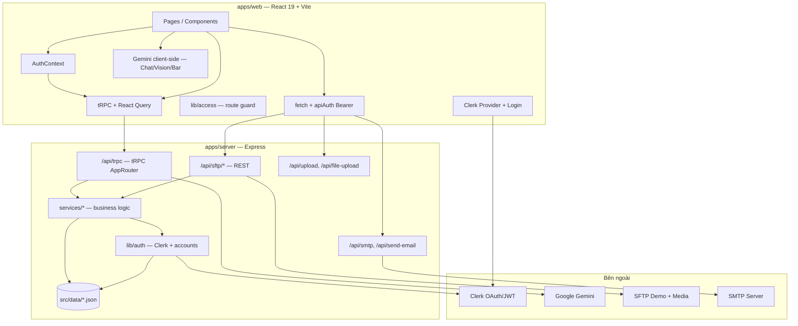
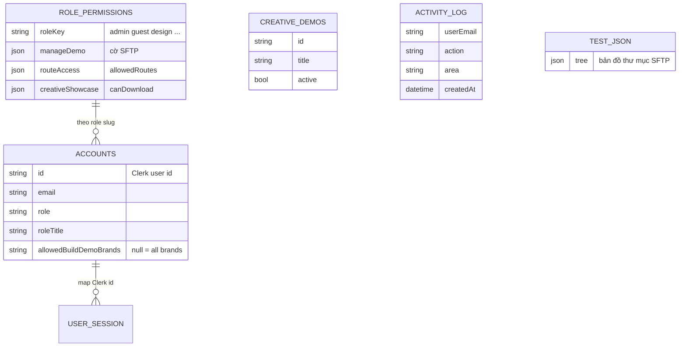
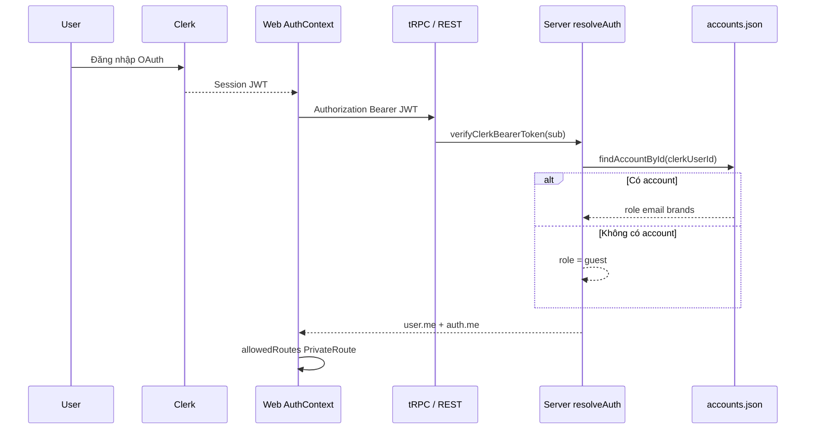
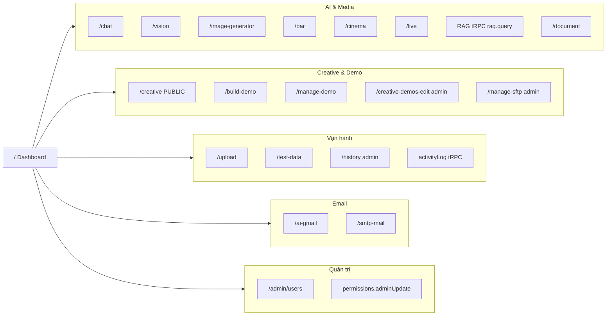
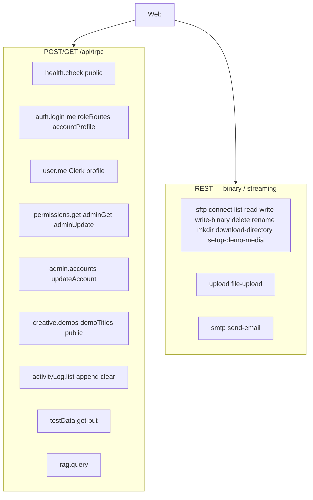
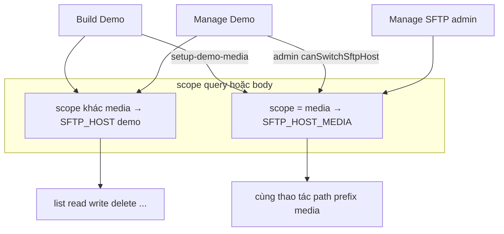
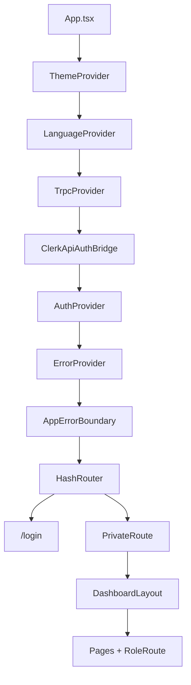

# NewDashboardYomedia

Dashboard nội bộ **YoMedia** — nền tảng creative tích hợp AI (Gemini), quản lý demo/HTML5, SFTP, upload và phân quyền theo vai trò.

Monorepo **pnpm workspaces** gồm web admin, API backend và app mobile (Expo).

Kiến trúc chi tiết: [Sơ đồ chức năng mô hình](#sơ-đồ-chức-năng-mô-hình).

---

## Tính năng chính

| Module | Mô tả |
|--------|--------|
| **AI Chat & Vision** | Hội thoại và phân tích hình ảnh qua Google Gemini |
| **Creative / Live / Cinema** | Showcase creative, stream và nội dung đa phương tiện |
| **Build Demo** | Chuyển đổi & đóng gói demo HTML5, đồng bộ brand lên SFTP media |
| **Manage Demo / SFTP** | Duyệt, upload, xóa file trên host demo và media (admin) |
| **Upload** | Upload file qua API backend |
| **RAG** | Hỏi đáp tài liệu nội bộ (tRPC `rag.query`) |
| **AI Gmail / SMTP** | Gửi mail qua SMTP (cấu hình server) |
| **History & Activity log** | Lịch sử thao tác người dùng |
| **Admin Users** | Quản lý tài khoản, role, route và brand được phép |
| **Mobile** | Ứng dụng Expo (phát triển song song) |

Xác thực: **Clerk** + **Google OAuth**. Phân quyền: `admin`, `guest`, và danh sách `allowedRoutes` / `allowedBuildDemoBrands` theo từng user.

---

## Tech stack

| Layer | Công nghệ |
|-------|-----------|
| Web | React 19, Vite 6, TypeScript, React Router 7, TanStack Query, **tRPC client**, Zod, React Hook Form, Clerk |
| Server | Express 4, **tRPC** (`/api/trpc`), TypeScript, LangChain + Gemini, SFTP (`ssh2-sftp-client`), JSZip, Nodemailer |
| Mobile | Expo 54, React Native, Expo Router |
| Workspace | pnpm 10+, `nodeLinker: hoisted` |

---

## Cấu trúc dự án

```text
NewDashboardYomedia/
├── apps/
│   ├── web/                    # Dashboard UI (port 3000)
│   │   └── lib/trpc/           # tRPC client, React Query provider, api helpers
│   ├── server/                 # Express + tRPC (port 3001+, .dev-api-port)
│   │   ├── src/trpc/           # Router, context, procedures (auth, admin, …)
│   │   ├── src/services/       # Business logic (permissions, auth, activity log, …)
│   │   ├── src/routes/       # REST còn lại: SFTP binary/ZIP, upload, SMTP
│   │   └── src/lib/          # SFTP, Clerk, RAG, media
│   └── mobile/                 # Expo app
├── packages/
│   └── api/                    # Export type `AppRouter` cho web (end-to-end types)
├── pnpm-workspace.yaml
└── README.md
```

### API

| Kiểu | Đường dẫn | Mục đích |
|------|-----------|----------|
| **tRPC** | `POST/GET /api/trpc` | Auth, user, permissions, admin, creative, activity log, test data, RAG, health |
| **REST** | `/api/sftp/*` | SFTP (đặc biệt `write-binary`, `download-directory` streaming) |
| **REST** | `/api/upload`, `/api/file-upload`, `/api/smtp` | Upload file, file center, gửi mail |

Web gọi tRPC qua `lib/trpc/api.ts` (Clerk Bearer tự gắn). Vite dev proxy mọi `/api/*` sang server.

### Routes web (HashRouter)

| Path | Ghi chú |
|------|---------|
| `/` | Dashboard |
| `/chat`, `/vision`, `/live`, `/cinema`, `/bar` | AI & media |
| `/build-demo`, `/upload` | Theo `allowedRoutes` của user |
| `/manage-sftp`, `/admin/users`, `/creative-demos-edit` | Chỉ **admin** |
| `/history`, `/ai-gmail`, `/smtp-mail` | Theo role |
| `/creative` | Public (không cần đăng nhập) |
| `/login` | Đăng nhập Clerk |

---

## Sơ đồ chức năng mô hình

Tài liệu kiến trúc chức năng của monorepo: luồng xác thực, dữ liệu JSON, tRPC/REST, và map route → API. Sơ đồ dùng [Mermaid](https://mermaid.js.org/) (GitHub / VS Code preview).

### Kiến trúc tổng thể (3 lớp)



| Lớp | Vai trò |
|-----|---------|
| **Web** | UI, HashRouter, guard route (`PrivateRoute`, `RoleRoute`), gắn JWT Clerk vào API |
| **Server** | Xác thực, phân quyền, SFTP/upload/mail, RAG, admin |
| **packages/api** | Export type `AppRouter` — type-safe end-to-end cho web |

### Mô hình dữ liệu (JSON tĩnh)



| File (`apps/server/src/data/`) | Chức năng |
|--------------------------------|-----------|
| `accounts.json` | User nội bộ: **id = Clerk userId**, role, `allowedBuildDemoBrands` |
| `role-permissions.json` | Template quyền theo **role** (routes, SFTP, creative download) |
| `creative-demos.json` | Danh sách demo showcase |
| `activity-log.json` | Nhật ký thao tác |
| `test.json` | Cây thư mục SFTP (sync từ API) |

### Xác thực & phân quyền



| Tầng | Cơ chế | Code chính |
|------|--------|------------|
| **Identity** | Clerk JWT | `clerkVerify.ts`, `ClerkApiAuthBridge` |
| **Authorization** | Role + routes từ account, merge `role-permissions.json` | `services/permissions.ts`, `services/auth.ts` |
| **UI guard** | `PrivateRoute` + `RoleRoute` + `lib/access.ts` | `App.tsx` |
| **API guard** | `protectedProcedure` / `adminProcedure` / `requireClerkAuth` | `trpc/trpc.ts`, `routes/*` |

Role chính: `admin`, `guest`, `manager` (alias `adsopmanager`), và role tùy chỉnh trong `role-permissions.json`.

### Module chức năng (theo route)



| Route web | Chức năng | API chính | Quyền |
|-----------|-----------|-----------|-------|
| `/login` | Đăng nhập Clerk | — | Public |
| `/creative` | Showcase demo | `creative.demos` (public) | **Public** |
| `/chat`, `/vision`, `/bar` | AI Gemini (client) | `GEMINI_API_KEY` trên web | Theo `allowedRoutes` |
| `/document` | Tài liệu | UI; có thể kết hợp RAG | Theo route |
| (trong app) | Hỏi đáp tài liệu | `rag.query` | JWT + protected |
| `/build-demo` | HTML5, sync brand | REST `/api/sftp/*`, `setup-demo-media` | Route + `allowedBuildDemoBrands` |
| `/manage-demo` | Duyệt/sửa SFTP | REST SFTP | `manageDemo.*` theo role |
| `/manage-sftp` | SFTP admin đầy đủ | REST SFTP `scope=media` | **admin** + `canSwitchSftpHost` |
| `/upload` | Upload file | `/api/upload`, `/api/file-upload` | Theo route |
| `/history` | Lịch sử | `activityLog.list` | **admin** (route) |
| `/test-data` | `test.json` | `testData.get` / `put` | Deny **guest** |
| `/admin/users` | Sửa account | `admin.accounts`, `admin.updateAccount` | **admin** |
| `/ai-gmail`, `/smtp-mail` | Gửi mail | `/api/smtp/*` | SMTP: deny guest |

### tRPC AppRouter vs REST



**REST tách riêng** vì SFTP `write-binary` và `download-directory` cần body lớn hoặc streaming, không phù hợp JSON tRPC thuần.

| Namespace tRPC | Procedure | Auth |
|----------------|-----------|------|
| `health` | `check` | Public |
| `auth` | `login`, `me`, `roleRoutes`, `accountProfile` | Mixed |
| `user` | `me` | Public (cần Bearer cho profile Clerk) |
| `permissions` | `get` | Public |
| `permissions` | `adminGet`, `adminUpdate` | Admin |
| `admin` | `accounts`, `updateAccount` | Admin |
| `creative` | `demos`, `demoTitles` | Public |
| `activityLog` | `list`, `append`, `clear` | Protected |
| `testData` | `get`, `put` | Protected |
| `rag` | `query` | Protected |

### Luồng SFTP (demo vs media)



| Permission (`role-permissions.json` → `manageDemo`) | Ý nghĩa |
|------------------------------------------------------|---------|
| `canSftpUploadBinary` | Upload file lớn (`write-binary`) |
| `canSftpWriteFile` / `Delete` / `Rename` / `Mkdir` | Thao tác file/thư mục |
| `canSwitchSftpHost` | Chuyển host demo ↔ media (admin) |
| `canSetupMediaSftp` | Build Demo copy upload lên media CDN |
| `allowedBuildDemoBrands` | Giới hạn brand trên Build Demo (rỗng = tất cả) |

REST SFTP (`/api/sftp`, JWT bắt buộc): `connect`, `list`, `read`, `exists`, `write`, `write-binary`, `rename`, `mkdir`, `delete`, `download-directory`, `setup-demo-media`, `search-directories`, `sync-directory-map-to-test-json`.

### Cây provider web



Hydrate user: Clerk signed-in → `user.me` (profile Clerk) → `auth.me` (role, `allowedRoutes`, brands) → lưu `localStorage` key `yomedia-auth-user`.

**Tóm tắt:** Đăng nhập **Clerk** → map **`accounts.json`** → áp **`role-permissions.json`** → UI chỉ mở route trong `allowedRoutes`; API nhạy cảm dùng **JWT + role server-side**; **tRPC** cho auth/admin/RAG/log; **REST** cho SFTP binary, upload, SMTP; **Gemini** chạy client (chat/vision) và server (RAG).

---

## Yêu cầu

- **Node.js** 18+ (khuyến nghị 20+)
- **pnpm** 10+
- Tài khoản **Clerk**, **Google Cloud** (OAuth + Gemini API), và thông tin **SFTP** (nếu dùng quản lý file)

---

## Cài đặt

```bash
git clone <repo-url>
cd NewDashboardYomedia
pnpm install
```

---

## Chạy development

Chạy song song web + server (khuyến nghị):

```bash
pnpm dev
```

Mở **http://localhost:3000** (UI). API mặc định **3001**; Vite proxy `/api` → server (đọc `apps/web/.dev-api-port` nếu API đổi port).

Nếu cổng bận: dừng tiến trình cũ (`Ctrl+C`), tránh chạy nhiều lần `pnpm dev`. Web **không** chiếm cổng 3001.

Hoặc từng app:

```bash
# Web — http://localhost:3000 (proxy /api → server)
pnpm --filter web dev

# Server — http://localhost:3001 (tự tìm port trống nếu bận)
pnpm --filter server dev

# Mobile
pnpm --filter mobile start
```

Khi server dev khởi động, port thực tế được ghi vào `apps/web/.dev-api-port` để Vite proxy `/api` đúng backend.

---

## Build production

```bash
pnpm --filter web build
pnpm --filter server build
pnpm --filter server start
```

Preview web sau build:

```bash
pnpm --filter web preview
```

---

## Biến môi trường

> **Không commit** `.env`, `.env.local`, credentials hay API key lên GitHub.

### `apps/web/.env`

| Biến | Bắt buộc | Mô tả |
|------|----------|--------|
| `VITE_CLERK_PUBLISHABLE_KEY` | Có | Clerk publishable key |
| `VITE_GOOGLE_CLIENT_ID` | Có | Google OAuth client ID |
| `GEMINI_API_KEY` | Có* | API Gemini (inject qua Vite `define`) |
| `VITE_SERVER_URL` | Production | URL API (vd. `http://host:3001`). Dev để trống → proxy `/api` |
| `VITE_API_PORT` | Không | Ghi đè port API khi dev (mặc định đọc `.dev-api-port`) |

\* Một số tính năng client gọi Gemini trực tiếp; RAG chạy trên server dùng `GEMINI_API_KEY` riêng.

### `apps/server/.env` hoặc `.env.local`

| Biến | Mô tả |
|------|--------|
| `PORT` | Port API (mặc định `3001`) |
| `CLERK_SECRET_KEY` | Xác thực Clerk phía server |
| `CLERK_JWT_KEY` | (Tùy chọn) JWT verification |
| `CLERK_AUTHORIZED_PARTIES` | Danh sách origin được phép |
| `GEMINI_API_KEY` | RAG / AI server-side |
| `SFTP_HOST`, `SFTP_PORT`, `SFTP_USER`, `SFTP_PASSWORD` | Host demo |
| `SFTP_HOST_MEDIA`, `SFTP_PORT_MEDIA`, `SFTP_USER_MEDIA`, `SFTP_PASSWORD_MEDIA` | Host media/CDN |
| `SFTP_MEDIA_MANAGE_PATH_PREFIX` | Tiền tố map path media (mặc định `media`) |
| `SMTP_HOST`, `SMTP_PORT`, `SMTP_USER`, `SMTP_PASS`, `SMTP_FROM`, `SMTP_SECURE` | Gửi mail |
| `EMAIL_USER`, `EMAIL_PASS` | Shortcut Gmail SMTP |

---

## API backend (tóm tắt)

| Prefix | Chức năng |
|--------|-----------|
| `GET /api/health` | Health check (public) |
| `/api/sftp/*` | Kết nối, list, read, write SFTP |
| `/api/rag/*` | RAG query tài liệu |
| `/api/upload`, `/api/file-upload` | Upload file |
| `/api/activity-log` | Nhật ký hoạt động |
| `GET /api/user/me` | Profile Clerk (Bearer JWT) |
| `POST /api/auth/me` | Role + routes từ `accounts.json` (Bearer JWT) |
| `/api/smtp/*`, `POST /api/send-email` | SMTP |
| `/api/test-data` | Dữ liệu test (theo quyền) |
| `/api/admin/*` | Quản trị (admin + Bearer JWT) |

Dữ liệu JSON tĩnh (accounts, demos, …) nằm trong `apps/server/src/data/`.

### Xác thực API (Clerk JWT)

Các API nhạy cảm (SFTP, upload, RAG, activity log, SMTP, admin, …) dùng middleware `requireClerkAuth`:

1. Client gửi `Authorization: Bearer <Clerk session JWT>` (web tự gắn qua `fetchJsonOrThrow` / `fetchWithApiAuth`).
2. Server verify token bằng `CLERK_SECRET_KEY` (hoặc `CLERK_JWT_KEY`).
3. Role lấy từ `accounts.json` theo Clerk user id — **không tin** header `x-user-role` khi JWT hợp lệ.

Dev không có `CLERK_SECRET_KEY`: fallback `x-user-role` (cảnh báo console). Production **bắt buộc** `CLERK_SECRET_KEY`.

Public (không JWT): `GET /api/health`, `GET /api/permissions`, `GET /api/creative-demos`, `POST /api/login` (legacy).

---

## Lint & kiểm tra type

```bash
pnpm --filter web lint
pnpm --filter server lint
pnpm --filter mobile lint
```

---

## Bảo mật

- Không đẩy file `.env`, `.env.production`, key SFTP/SMTP lên remote.
- API nhạy cảm yêu cầu Clerk Bearer JWT; role server-side từ `accounts.json`, không dựa vào `x-user-role` khi đã verify JWT.
- Route admin và SFTP media yêu cầu role `admin`.
- Guest bị chặn một số route (`/smtp-mail`, `/test-data`, …).
- User thường chỉ truy cập route trong `allowedRoutes` (cấu hình qua admin).

---

## License

Dự án nội bộ YoMedia — sử dụng theo chính sách tổ chức.
