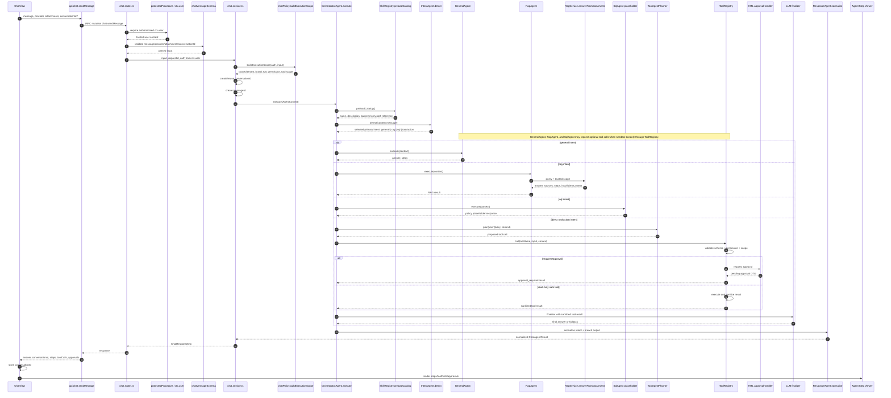
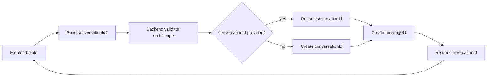
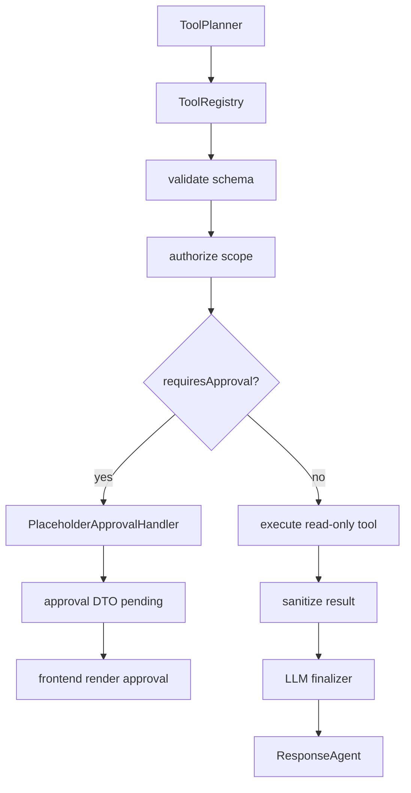
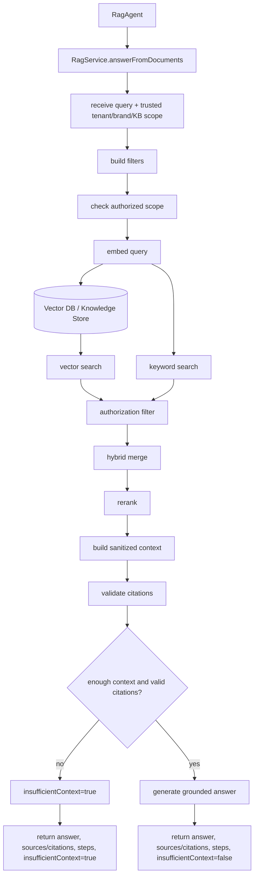

# Chat Flow Architecture

This document maps the current chat runtime and the safety boundaries for intent routing, tools, HITL approval, RAG, SQL, and the frontend Agent Step Viewer.

## Entry Points

- Frontend UI: `apps/web/src/components/chatbot/ChatView.tsx`
- Frontend API wrapper: `apps/web/src/api/trpc/api.ts`
- Backend tRPC route: `apps/api/src/trpc/routers/chat.router.ts`
- Backend schema: `apps/api/src/modules/chat/chat.schema.ts`
- Backend service: `apps/api/src/modules/chat/chat.service.ts`
- Backend policy: `apps/api/src/modules/chat/chat.policy.ts`
- Backend runtime context: `apps/api/src/ai/runtime/agent-context.ts`
- Backend orchestration: `apps/api/src/ai/agents/orchestrator/`
- Backend tool registry: `apps/api/src/ai/tools/tool-registry.ts`
- Backend skill registry: `apps/api/src/ai/skills/skill-registry.ts`
- HITL approval handler: `apps/api/src/ai/hitl/approval-handler.ts`
- RAG service: `apps/api/src/rag/rag.service.ts`
- Response normalization: `apps/api/src/ai/agents/response/response.agent.ts`

## Overview Architecture

```mermaid
flowchart TD
  User[User] --> ChatView

  subgraph Frontend
    ChatView[ChatView]
    LocalState[React state: messages, loading, conversationId]
    LegacyFlow{Legacy local upload/banner pending flow?}
    SendMessage[api.chat.sendMessage]
    StepViewer[Agent Step Viewer: steps, toolCalls, approvals, insufficientContext]
  end

  subgraph Backend_API[Backend API]
    Router[chat.router.ts]
    Protected[protectedProcedure / ctx.user]
    Schema[chatMessageSchema validation]
    Service[chat.service.ts]
    Policy[chatPolicy.buildExecutionScope]
    Context[AgentContext from trusted backend scope]
  end

  subgraph Orchestrator_Intent[Orchestrator / Intent]
    Orchestrator[OrchestratorAgent.execute]
    Skills[SkillRegistry.preloadCatalog]
    Intent[IntentAgent.detect]
    Primary{Selected primary intent}
    PrimaryGeneral[general]
    PrimaryRag[rag]
    PrimarySql[sql]
    PrimaryTool[tool/action or direct-tool/action]
  end

  subgraph Agent_Branches[Agent Branches]
    General[GeneralAgent]
    RagAgent[RagAgent]
    Sql[SqlAgent policy placeholder]
    ToolPlanner[ToolAgentPlanner]
    LlmFinalizer[LLM finalizer for sanitized tool result]
  end

  subgraph Shared_Tool_Capability[Shared Tool Capability]
    ToolRegistry[ToolRegistry]
    ValidateName[validate toolName]
    ValidateInput[validate input schema]
    CheckPermission[check permission]
    EnforceScope[enforce tenant/brand/tool scope]
    CheckApproval[check requiresApproval]
    SanitizeResult[sanitize result]
  end

  subgraph Tools_HITL[Tools / HITL]
    ApprovalGate{requiresApproval?}
    HITL[PlaceholderApprovalHandler]
    PendingApproval[Pending approval DTO]
    ToolExec[Execute read-only tool]
    LoadSkill[load_skill(name)]
  end

  subgraph RAG[RAG]
    RagService[RagService.answerFromDocuments]
    RagFilters[tenant/brand/knowledge-base filters]
    KnowledgeStore[(Vector DB / Knowledge Store<br/>documents, chunks, embeddings, metadata, citations)]
    RagAnswer[grounded answer or insufficientContext]
  end

  subgraph SQL_Data[SQL Data Boundary]
    SqlSafety[SQL Safety<br/>read-only, allowlist, row limit, timeout]
    BusinessDb[(Business / Report Database<br/>report, crawl, business, dashboard data)]
  end

  subgraph Response_Logging[Response / Logging]
    ResponseAgent[ResponseAgent.normalize]
    ChatDto[ChatResponseDto]
    Logs[Sanitized chat.flow logs]
    LogStore[(Log / Audit Store<br/>step logs, audit logs, tool runs, policy decisions, errors)]
  end

  subgraph App_Persistence[Application Persistence]
    AppDb[(Application Database<br/>users, tenants, brands, roles, permissions, sessions, configs<br/>chat messages, agent runs, tool runs, approvals)]
  end

  ChatView --> LocalState --> LegacyFlow
  LegacyFlow -->|pending local workflow| ChatView
  LegacyFlow -->|none| SendMessage
  SendMessage --> Router --> Protected --> Schema --> Service --> Policy --> Context
  Context --> Orchestrator --> Skills --> Intent --> Primary
  Primary --> PrimaryGeneral --> General
  Primary --> PrimaryRag --> RagAgent --> RagService --> RagFilters --> KnowledgeStore --> RagAnswer
  Primary --> PrimarySql --> Sql --> SqlSafety --> BusinessDb
  Primary --> PrimaryTool --> ToolPlanner

  ToolPlanner --> ToolRegistry
  General -. optional tool call .-> ToolRegistry
  RagAgent -. optional tool call .-> ToolRegistry
  Sql -. optional tool call .-> ToolRegistry

  ToolRegistry --> ValidateName --> ValidateInput --> CheckPermission --> EnforceScope --> CheckApproval --> ApprovalGate
  ApprovalGate -->|yes| HITL --> PendingApproval --> ResponseAgent
  ApprovalGate -->|no| ToolExec --> SanitizeResult --> LlmFinalizer --> ResponseAgent
  ToolRegistry --> LoadSkill --> SanitizeResult

  General --> ResponseAgent
  RagAnswer --> ResponseAgent
  Sql --> ResponseAgent
  ResponseAgent --> ChatDto --> SendMessage --> ChatView --> StepViewer
  Router --> AppDb
  Context --> AppDb
  Orchestrator --> AppDb
  CheckPermission --> AppDb
  HITL --> AppDb
  ResponseAgent --> AppDb
  Service --> Logs
  Orchestrator --> Logs
  ToolRegistry --> Logs
  RagService --> Logs
  ResponseAgent --> Logs
  Logs --> LogStore
  CheckPermission --> LogStore
```

The canonical runtime path remains:

`Frontend ChatView` -> `api.chat.sendMessage` -> `chat.router.ts` -> `protectedProcedure / ctx.user` -> `chatMessageSchema` -> `chat.service.ts` -> `chatPolicy.buildExecutionScope` -> `AgentContext` -> `OrchestratorAgent.execute` -> `SkillRegistry.preloadCatalog` -> `IntentAgent.detect` -> `Unified Policy Gate` -> route to `general` / `RAG Service -> Vector DB / Knowledge Store` / `SQL Safety -> Business / Report Database` / `Shared Tool Gate -> Tool Executor` -> `ResponseAgent.normalize` -> `ChatResponseDto` -> frontend stores `conversationId` and renders Agent Step Viewer.

The frontend never connects directly to the Application Database, Vector DB / Knowledge Store, Business / Report Database, Log / Audit Store, SFTP Service, or Secrets Manager.

## Intent Versus Tool Capability

`intent` describes the user's primary goal and the main handling strategy.

Current primary intents:

- `general`: answer using the current LLM provider.
- `rag`: answer using authorized knowledge-base documents.
- `sql`: answer using database/data reasoning, currently a policy placeholder unless explicitly implemented.
- `tool` / `action`: execute or prepare a backend action through tools.

Important distinction:

`tool` is both:

1. a direct intent for action-style requests, and
2. a shared capability that General/RAG/SQL agents may use through `ToolRegistry`.

No agent should execute tools directly. Every tool call must go through `ToolRegistry` for:

- tool name validation
- input schema validation
- permission check
- tenant/brand/KB scope enforcement where applicable
- approval gating
- result sanitization
- safe logging

The code currently keeps the enum/string value `tool` for backward compatibility. In architecture docs, read it as `direct-tool/action intent` or `tool/action`. Tool is not only an intent; it is also the shared capability layer for approved backend actions.

## Examples of Intent and Tool Usage

### Example 1: Direct action intent

User:

`Kiem tra file /demo/a.zip co ton tai tren SFTP khong?`

Primary intent:

`tool` / `action`

Flow:

`IntentAgent` -> `ToolAgentPlanner` -> `ToolRegistry` -> `sftp_exists_check` -> sanitized result -> `ResponseAgent`

### Example 2: RAG plus optional tool

User:

`Dua tren tai lieu upload demo, file output nen nam o dau? Kiem tra giup toi file do da ton tai chua.`

Primary intent:

`rag`

Flow:

`IntentAgent` -> `RagAgent` -> `RagService` finds the expected output path -> optional `ToolRegistry` call to `sftp_exists_check` -> `ResponseAgent`

### Example 3: General explanation without tool execution

User:

`Giai thich tool sftp_exists_check dung lam gi.`

Primary intent:

`general`

Flow:

`IntentAgent` -> `GeneralAgent` -> `ResponseAgent`

### Example 4: SQL with safe tool/policy gate

User:

`Xoa cac record demo loi trong database.`

Primary intent:

`sql`

Flow:

`IntentAgent` -> `SqlAgent` -> `ToolRegistry / approval gate required before any mutation`

SQL mutation/update/delete/drop must never execute directly without policy, scope, approval, audit log, and result sanitizer.

## Sequence Diagram



## Conversation and Message Lifecycle

- Frontend keeps `conversationId` in React state.
- If the first request has no `conversationId`, the backend creates a new one.
- If a later request includes `conversationId`, the backend may reuse it but must still check auth and scope.
- Backend creates a new `messageId` for every request.
- Response always returns `conversationId`.
- `conversationId` from the frontend is input only. Backend must derive trusted user, tenant, brand, KB, and tool scope from `ctx.user`.
- Do not treat `conversationId` as proof of authorization.



## Skill Loading Strategy

- `SkillRegistry` preloads only catalog metadata for model/planner use: `name`, `description`, and a backend-only path reference.
- Full `SKILL.md` bodies are not placed into the default model context.
- Full skill body is loaded only when the planner calls backend tool `load_skill(name)`.
- Successful load must emit step `skill.loaded`.
- This reduces context size, avoids leaking unnecessary skill content, and keeps backend control over file access.
- `load_skill(name)` must validate the skill name, reject traversal-like input such as `../`, read only registered skills under the configured skill root, sanitize the body, and return sanitized content.

```mermaid
flowchart TD
  Orchestrator[Orchestrator] --> Catalog[SkillRegistry.preloadCatalog]
  Catalog --> Planner[Intent/ToolPlanner]
  Planner --> NeedSkill{Need skill?}
  NeedSkill -->|no| Continue[Continue without body]
  NeedSkill -->|yes| LoadSkill[load_skill(name)]
  LoadSkill --> Validate[validate skill name]
  Validate --> Read[read SKILL.md]
  Read --> Sanitize[sanitize body]
  Sanitize --> Return[return skill body]
  Return --> Step[emit skill.loaded step]
```

## Tool and HITL Approval Lifecycle

- `ToolAgentPlanner` only proposes a tool/action.
- `ToolRegistry` owns execution control:
  - validate `toolName`
  - validate input schema
  - check permission
  - check tenant/brand scope
  - check `requiresApproval`
  - sanitize result
- If `requiresApproval = true`, the tool must not execute immediately.
- `DurableApprovalHandler` returns a pending approval DTO and persists the approval record.
- The approval route receives `approvalId`, re-checks policy, writes durable audit logs, then executes the stored approved action through `ToolGateway` and `ToolExecutor`.

Approval DTO must include:

- `approvalId`
- `status: pending`
- `toolName`
- `reason`
- sanitized `inputSummary`
- `createdAt`

Dangerous actions must always use `requiresApproval = true`:

- delete
- upload
- overwrite
- send message
- external campaign/banner changes
- SQL mutation/update/delete/drop



Current built-in tool behavior:

- `build_preview_link`: read-only backend tool that builds a demo preview URL from a remote path.
- `sftp_exists_check`: registered as read-only, but currently returns a skipped result until a backend SFTP provider is wired.
- `delete_uploaded_demo`: approval-required legacy workflow action.
- `build_demo_convert_upload`: approval-required legacy workflow action.
- `banner_setup`: approval-required for external campaign/banner changes.
- `send_message`: approval-required placeholder for future external messaging.
- `sql_mutation`: approval-required placeholder for future SQL mutation policy.
- `load_skill`: read-only tool that loads a full skill body only after the planner asks for a named skill.

## RAG Branch

RAG service boundary stays in `RagService.answerFromDocuments`. The branch must use trusted backend scope, not client-provided tenant, brand, role, or KB hints.



RAG requirements:

- Use trusted scope from the backend.
- Apply tenant, brand, and knowledge-base filters before answer generation.
- Apply authorization filtering to retrieved candidates.
- Use sanitized context for generation.
- Validate citations against retrieved chunks.
- Return `insufficientContext = true` when authorized context is missing, too small, or citations are invalid.
- Do not return raw private document content to the frontend unless a frontend-safe citation/source DTO explicitly requires it.
- Keep documents, chunks, embeddings, metadata, and citation references in the Vector DB / Knowledge Store. The RAG service retrieves from that store and does not act as the persistence layer itself.

## SQL Branch

The SQL branch is currently a policy placeholder if no implementation is explicitly wired.

- `SqlAgent` must not query any database directly.
- The allowed path is `SqlAgent` -> `Agent Runtime Core` -> `Unified Policy Gate` -> `SQL Safety` -> `Business / Report Database`.
- Do not execute SQL directly until permission policy, tenant/brand scope, audit log, and result sanitizer are implemented.
- Future read-only query support still needs scope limits, allowlisted tables/views, row limits, and timeouts.
- Mutation, update, delete, drop, and other destructive SQL operations must require approval.
- Do not log raw SQL containing sensitive data.
- Sanitize query results before returning them to the model or frontend.
- SQL agent must not bypass `ToolRegistry` or a dedicated policy gate if a tool/query executor is later added.
- The Business / Report Database is for report, crawl, business, and dashboard data. Do not conflate it with the Application Database unless an explicit schema and policy design says they share one physical backend.

## Data Layer / Persistence

- `Application Database`: users, tenants, brands, roles, permissions, sessions, configs, chat sessions/messages, agent runs, tool runs, pending approvals, approval history, and memory summaries.
- `Vector DB / Knowledge Store`: documents, chunks, embeddings, metadata, and citations used by `RAG Service`.
- `Business / Report Database`: read-only report, crawl, business, and dashboard data behind `SQL Safety`.
- `Log / Audit Store`: sanitized step logs, audit logs, tool runs, policy decisions, errors, and result sanitation records.

`SFTP Service / Remote Demo Storage` remains backend-only remote file/demo storage. It is not the application database or audit store.

## Logging and Observability Policy

Expected sanitized events and steps:

- `chat.flow.start`
- `chat.flow.step`
- `chat.flow.complete`
- `chat.flow.failed`
- `request.received`
- `scope.resolved`
- `conversation.resolved`
- `skill.catalog.preloaded`
- `skill.loaded`
- `intent.detected`
- `agent.routed`
- `tool.call`
- `tool.result`
- `approval.requested`
- `rag.insufficient_context`
- `response.normalized`

Logs may contain sanitized summaries, status, duration, counts, request id, conversation id, message id, intent, agent, and safe DTO metadata.

Logs must not contain:

- secrets
- credentials
- raw prompts
- private documents
- raw SQL internals
- access tokens
- full tool inputs when they may contain sensitive data
- raw file content
- raw RAG chunks when they contain private data

## Frontend Versus Backend Responsibility Matrix

| Frontend responsibilities | Backend responsibilities |
| --- | --- |
| render chat messages | authenticate with `protectedProcedure` |
| render attachments | derive trusted scope from `ctx.user` |
| handle loading state | validate chat input schema |
| keep `conversationId` in React state | build execution scope |
| send `conversationId` on later messages | create/reuse `conversationId` safely |
| send attachments metadata | create `messageId` |
| render Agent Step Viewer | select primary intent |
| render steps/toolCalls/approvals | execute agents |
| render insufficientContext warning if present | authorize tools through `ToolRegistry` |
| render pending approval DTO | enforce approval gate |
| continue local legacy upload/banner pending flow during migration | enforce RAG tenant/brand/KB filters |
| treat page context/client role as UI hints only | normalize `ChatResponseDto` |
| do not expose raw backend errors or secrets | sanitized logging |
| no backend business logic, RAG, SQL, MCP, or secrets | never trust client role/page context as authority |

## Implementation Checklist

- [ ] Verify `chat.router.ts` uses `protectedProcedure`.
- [ ] Verify `chatMessageSchema` validates message/provider/attachments/conversationId.
- [ ] Verify `chat.service.ts` creates/reuses `conversationId` correctly.
- [ ] Verify backend does not trust `conversationId` without auth/scope checks.
- [ ] Verify `chatPolicy.buildExecutionScope` derives trusted tenant/brand/KB/tool scope.
- [ ] Verify `OrchestratorAgent` emits steps for each major phase.
- [ ] Verify `SkillRegistry` only preloads catalog metadata.
- [ ] Verify `load_skill` loads full skill only on demand.
- [ ] Verify `load_skill` rejects invalid path/name.
- [ ] Verify direct action requests route to `tool/action` intent.
- [ ] Verify General/RAG/SQL agents may request tools only through `ToolRegistry`.
- [ ] Verify no agent executes a tool directly.
- [ ] Verify `ToolRegistry` validates name, schema, permission, scope and approval requirement.
- [ ] Verify approval-required tools return pending DTO and do not execute immediately.
- [ ] Verify tool results are sanitized before LLM finalizer or frontend response.
- [ ] Verify RAG applies tenant/brand/KB filters before answer generation.
- [ ] Verify SQL branch is placeholder or safely gated.
- [ ] Verify SQL mutation/update/delete/drop requires approval.
- [ ] Verify `ResponseAgent.normalize` always returns `ChatResponseDto` shape.
- [ ] Verify logs are sanitized.
- [ ] Verify frontend renders steps/toolCalls/approvals.
- [ ] Verify frontend renders insufficientContext warning if present.
- [ ] Verify docs explain that `tool` is both direct intent and shared capability.

## Manual Test Checklist

Use this if no dedicated test script covers the chat UI end to end.

- [ ] General intent returns a normalized response.
- [ ] RAG insufficient context returns `insufficientContext = true`.
- [ ] Read-only tool executes through `ToolRegistry` and returns a sanitized result.
- [ ] Approval-required tool returns pending approval and does not execute.
- [ ] Invalid tool input returns a safe validation error.
- [ ] First message creates `conversationId`; next message reuses it.
- [ ] `SkillRegistry.preloadCatalog` does not include full skill body in catalog output.
- [ ] `load_skill` rejects invalid path/name.
- [ ] General/RAG/SQL agents cannot bypass `ToolRegistry` when calling tools.
