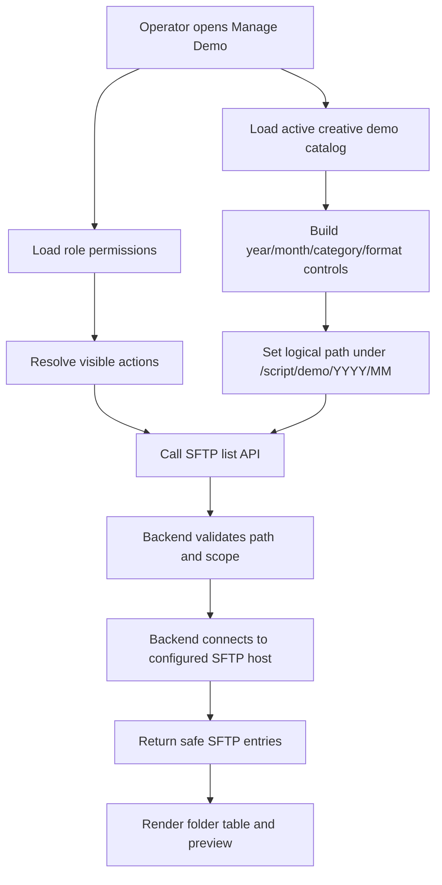

# Manage Demo + SFTP Model

## Purpose

Manage Demo is the internal workflow for browsing demo assets, checking preview output, and performing controlled SFTP file operations for YoMedia demo delivery. The model keeps SFTP credentials and file-system execution in the backend while the web app only renders UI, collects operator intent, and calls approved APIs.

## Current Ownership

| Area | Owner | Current files |
| --- | --- | --- |
| Manage Demo screen | Web app | `apps/web/src/pages/ManageDemo.tsx` |
| Generic SFTP client wrapper | Web app | `apps/web/src/utils/sftpClient.ts` |
| SFTP API router | API server | `apps/api/src/modules/sftp/sftp.router.ts` |
| SFTP business logic | API server | `apps/api/src/modules/sftp/sftp.service.ts` |
| SFTP environment | API server | `apps/api/src/config/env.ts` |
| Upload audit listing | API server + web | `apps/api/src/modules/activity-log/*`, `apps/web/src/utils/activityLog.ts` |
| Build/upload demo flows | Web app + API endpoints | `apps/web/src/pages/BuildDemo.tsx`, `apps/web/src/pages/Upload.tsx` |

## Boundary Rules

- The frontend must not hold SFTP credentials, open SFTP connections, resolve host roots, or authorize protected operations.
- The backend owns SFTP connection config, path normalization, allowed-root checks, SFTP execution, safe errors, and structured logging.
- Client-provided role, scope, path, or permission data is treated as a UI hint only. Backend authorization must be derived from authenticated context before any protected SFTP mutation.
- All SFTP paths are normalized as POSIX paths. Path traversal, paths outside the configured root, and host-root escapes must be rejected before connecting or executing.
- SFTP credentials, private keys, remote errors with secrets, and raw file contents must not be logged.

## SFTP Scopes

The app models two SFTP scopes:

| Scope | UI meaning | Backend env | Logical display |
| --- | --- | --- | --- |
| `demo` | Primary demo host | `SFTP_HOST`, `SFTP_PORT`, `SFTP_USERNAME`, `SFTP_PASSWORD` or `SFTP_PRIVATE_KEY`, `SFTP_ROOT` | `/script/demo/...` |
| `media` | Media host used by selected admin workflows | `SFTP_MEDIA_HOST`, `SFTP_MEDIA_PORT`, `SFTP_MEDIA_USERNAME`, `SFTP_MEDIA_PASSWORD` or `SFTP_MEDIA_PRIVATE_KEY`, `SFTP_MEDIA_ROOT` | UI may display `/media/...` while preserving a logical demo-root mapping |

The current backend list service maps an incoming logical path under `SFTP_ROOT` to the selected scope root. This lets the UI keep paths like `/script/demo/2026/06/...` while the backend chooses the physical host root for `demo` or `media`.

## Main Data Model

### Remote Path

```ts
type SftpScope = "demo" | "media";

type RemotePath = {
  scope: SftpScope;
  logicalPath: string; // e.g. /script/demo/2026/06/brand/campaign/970x250
  remotePath: string; // backend-resolved path under the selected host root
};
```

### SFTP Entry

```ts
type SftpEntry = {
  name: string;
  type: string; // ssh2-sftp-client returns d for directory, - for file
  size: number;
  modifyTime?: number;
};
```

### Manage Demo Permission Shape

```ts
type ManageDemoPermissions = {
  canUseFileActionButtons?: boolean;
  canSwitchSftpHost?: boolean;
  canSftpUploadBinary?: boolean;
  canSftpWriteFile?: boolean;
  canSftpDelete?: boolean;
  canSftpRename?: boolean;
  canSftpMkdir?: boolean;
  canSetupMediaSftp?: boolean;
  allowedBuildDemoBrands?: string[] | null;
};
```

Frontend uses this shape to hide or disable controls. Backend endpoints still need their own authorization checks before executing mutations.

## Manage Demo Screen Flow



The screen starts at `/script/demo/{year}/{month}`. Folder navigation is constrained so users browse within the demo tree instead of escaping to the SFTP root. The UI detects creative size/category from the folder name and listing, then uses the creative demo catalog to choose preview behavior.

## SFTP Operation Model

| Operation | UI trigger | Backend responsibility | Audit |
| --- | --- | --- | --- |
| List folder | Open Manage Demo, navigate folder, refresh | Validate query, resolve remote path, call `client.list` | No audit required |
| Read file | Open editable file | Validate path, enforce read permission, return text content only | Optional |
| Write file | Save editor content | Validate path/content, enforce write permission, write text/base64 | `Manage Demo` activity |
| Upload binary | Drop file(s) into current folder | Validate path, size/type policy, enforce upload/write permission, stream/write binary | `manage_demo_drop_upload_success` or partial |
| Rename | Rename file or folder | Validate old/new path, enforce rename permission, avoid root escape | `Manage Demo` activity |
| Delete | Delete file or folder | Validate path, enforce delete permission, require confirmation in UI | `Manage Demo` activity |
| Mkdir | Create folder | Validate name/path, enforce mkdir permission | `Manage Demo` activity |
| Setup demo to media | Admin setup action | Copy demo folder to media scope with dry-run/conflict controls | `Manage Demo` or `Build Demo` activity |

`apps/web/src/utils/sftpClient.ts` already exposes client methods for these operations. In the current backend snapshot, `apps/api/src/modules/sftp/sftp.router.ts` only wires `GET /api/sftp/list`; the remaining routes must exist in the API server before their UI methods are considered fully backed by the current architecture.

## Upload And Build Demo Relationship

Manage Demo is not the only workflow that writes to demo storage:

- `BuildDemo` stages creative assets, derives a remote demo path, uploads output to SFTP, can copy to media SFTP, and records upload activity.
- `Upload` stages `.fla` and `.psd` folders, requires a selected Creative Demo Title, uploads to the server-side upload flow, and records activity.
- `ManageDemo` browses the resulting SFTP tree, previews existing output, and performs maintenance operations on files and folders when permissions allow.

These flows should converge on the same path conventions:

```text
/script/demo/{year}/{month}/{brand-or-client}/{campaign-or-format}/{asset-folder}
```

Video workflows may use format-oriented folders such as `video`, `instream`, or generated names. HTML/JS display and mobile workflows commonly use creative sizes such as `970x250`, `300x250`, or `480x270`.

## Preview Model

Manage Demo builds previews from the selected folder/file and the demo catalog:

- Directory rows navigate deeper into SFTP.
- File rows can open remote media directly.
- The preview panel uses demo URL helpers such as `buildDemoRemoteRelativePath` and `useDemoPreviewUrl`.
- The preview link should be derived from a safe relative path under the demo root, not from arbitrary user-entered full URLs.

## Audit Model

Upload-related activity is stored through the activity-log module and displayed to admins in Manage Demo.

Relevant actions include:

- `manage_demo_drop_upload_success`
- `manage_demo_drop_upload_partial`
- `upload_demo_success`
- `upload_demo_partial`
- `upload_folder`

The list endpoint for `special: "manage-demo-uploads"` is admin-only and filters to the current tenant. Scope filtering uses `metadata.sftpScope` when present, then falls back to target path prefixes like `/script/demo/...` or `/media/...`.

Recommended metadata for SFTP write operations:

```ts
type SftpActivityMetadata = {
  sftpScope: "demo" | "media";
  files?: string[];
  previousPath?: string;
  isDir?: boolean;
  sizeBytes?: number;
  result?: "success" | "partial" | "failed";
};
```

## Error Handling

Expected backend errors should use safe application errors:

| Code | Meaning |
| --- | --- |
| `INVALID_SFTP_REQUEST` | Query/body failed validation |
| `SFTP_NOT_CONFIGURED` | Missing host, username, or credential |
| `SFTP_PATH_OUTSIDE_ROOT` | Requested path escapes logical or physical root |
| `SFTP_LIST_FAILED` | SFTP host returned an error during list |

Mutation routes should add similarly specific codes such as `SFTP_WRITE_FAILED`, `SFTP_DELETE_FAILED`, `SFTP_RENAME_FAILED`, and `SFTP_MKDIR_FAILED`.

## Security Checklist

- Derive user, tenant, role, and permission scope from authenticated backend context.
- Enforce permission per operation on the backend, not only by hiding frontend controls.
- Reject paths outside the logical root and selected scope root before connecting to SFTP.
- Never return or log SFTP credentials, private keys, stack traces, or confidential file contents.
- Log sanitized path, scope, event name, and user/tenant identifiers only.
- Require explicit confirmation for destructive actions such as delete and overwrite.
- Keep media-host switching admin-only unless a separate policy allows more roles.

## Implementation Gap To Close

The frontend SFTP client currently models a broader API than the backend router shown in this snapshot. To make Manage Demo fully consistent, the backend should expose and authorize these routes with the same Zod validation and root-resolution model as `list`:

```text
GET  /api/sftp/list
GET  /api/sftp/read
GET  /api/sftp/exists
POST /api/sftp/write
POST /api/sftp/write-binary
POST /api/sftp/delete
POST /api/sftp/rename
POST /api/sftp/mkdir
POST /api/sftp/setup-demo-media
GET  /api/sftp/download-directory
```

Each route should be thin: parse input, derive authenticated context, enforce policy, call the SFTP service, and return a frontend-safe DTO.
