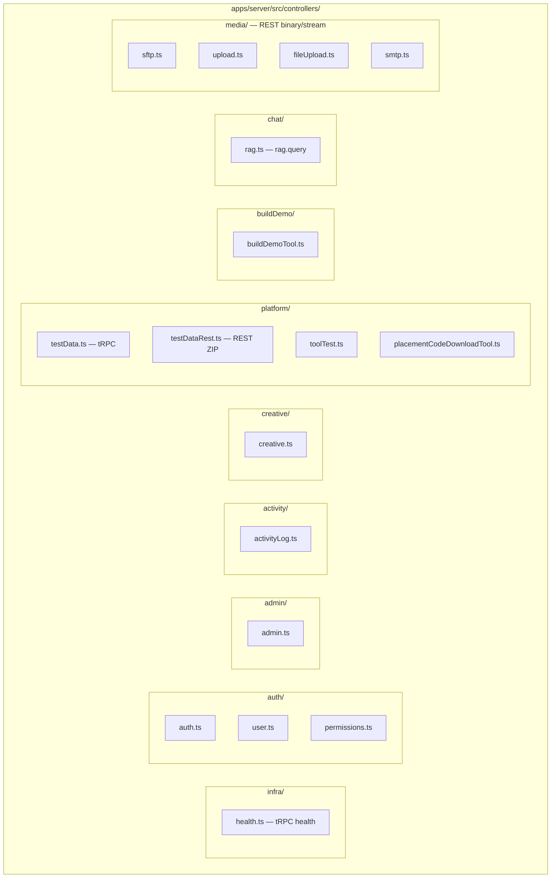
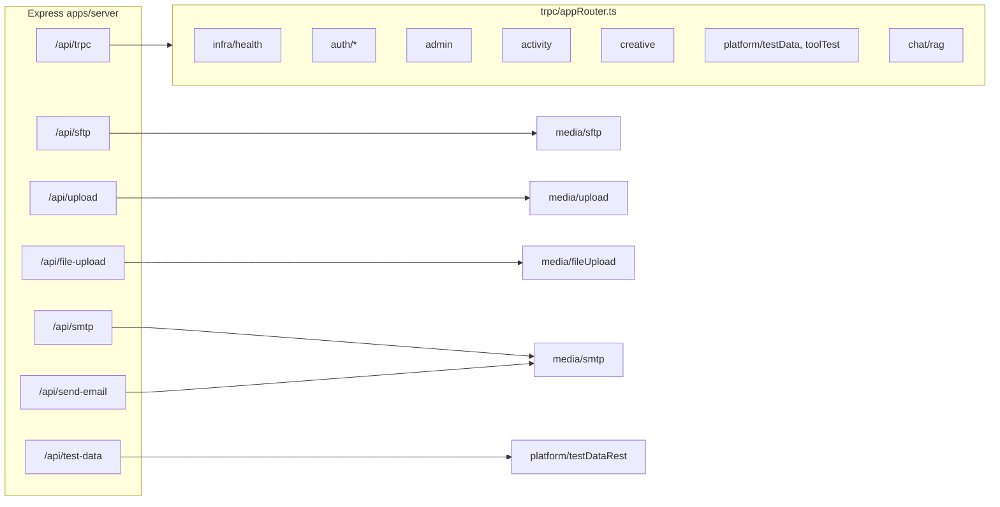
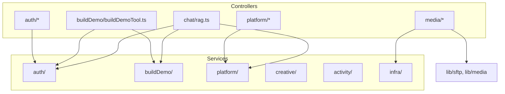

# Server — Controllers layer (`apps/server/src/controllers`)

Tài liệu mô tả cấu trúc **controllers** phân loại theo domain, song song với [`server-services-architecture.md`](./server-services-architecture.md).

> Build Demo: [`server-build-demo-architecture.md`](./server-build-demo-architecture.md)  
> Chat / Supervisor: [`chat-agent-flow.md`](./chat-agent-flow.md)

---

## 1. Sơ đồ cây thư mục



---

## 2. Sơ đồ mount API



---

## 3. Bảng phân loại

| Thư mục | File | Loại API | Mô tả |
|---------|------|----------|--------|
| **infra/** | `health.ts` | tRPC | Health check |
| **auth/** | `auth.ts`, `user.ts`, `permissions.ts` | tRPC | Login, profile, role permissions |
| **admin/** | `admin.ts` | tRPC | Quản lý account Clerk/local |
| **activity/** | `activityLog.ts` | tRPC | Activity log CRUD |
| **creative/** | `creative.ts` | tRPC | Creative demos catalog |
| **platform/** | `testData.ts` | tRPC | Test data JSON + platform snapshot |
| **platform/** | `testDataRest.ts` | REST | ZIP placement code (binary) |
| **platform/** | `toolTest.ts` | tRPC | Probe banner/platform API |
| **platform/** | `placementCodeDownloadTool.ts` | — | Tool handler (gọi từ Chat agent) |
| **buildDemo/** | `buildDemoTool.ts` | — | Tool handler Build Demo (Chat agent) |
| **chat/** | `rag.ts` | tRPC | `rag.query`, `rag.clearSession` |
| **media/** | `sftp.ts`, `upload.ts`, `fileUpload.ts`, `smtp.ts` | REST | SFTP, upload, file center, SMTP |

---

## 4. Luồng Controller → Service



---

## 5. Cấu trúc file (text)

```text
apps/server/src/controllers/
├── infra/
│   └── health.ts
├── auth/
│   ├── auth.ts
│   ├── user.ts
│   └── permissions.ts
├── admin/
│   └── admin.ts
├── activity/
│   └── activityLog.ts
├── creative/
│   └── creative.ts
├── platform/
│   ├── testData.ts              # tRPC testData.*
│   ├── testDataRest.ts          # REST GET placement-codes-zip
│   ├── toolTest.ts
│   └── placementCodeDownloadTool.ts
├── buildDemo/
│   └── buildDemoTool.ts
├── chat/
│   └── rag.ts
└── media/
    ├── sftp.ts
    ├── upload.ts
    ├── fileUpload.ts
    └── smtp.ts
```

**Entry points:**

- `trpc/appRouter.ts` — gộp tất cả tRPC routers
- `index.ts` — mount REST routers (`/api/sftp`, `/api/test-data`, …)

---

## 6. Quy ước

| Loại | Đặt ở | Ví dụ |
|------|-------|--------|
| tRPC procedure | Domain tương ứng | `platform/testData.ts` → `testData.platform` |
| REST (binary/stream) | `media/` hoặc domain có file REST riêng | `platform/testDataRest.ts` |
| Chat tool handler (không expose route riêng) | Domain nghiệp vụ | `buildDemo/buildDemoTool.ts`, `platform/placementCodeDownloadTool.ts` |

Tool handlers không mount Express trực tiếp — được gọi từ `lib/ai/agents/actions/runActionAgent.ts`.

---

## 7. Import path (ví dụ)

```ts
// appRouter
import { ragRouter } from "../controllers/chat/rag.js";
import { testDataRouter } from "../controllers/platform/testData.js";

// index.ts
import { sftpRouter } from "./controllers/media/sftp.js";
import { testDataRestRouter } from "./controllers/platform/testDataRest.js";

// AI agent
import { runBuildDemoTool } from "../../../../controllers/buildDemo/buildDemoTool.js";
```
