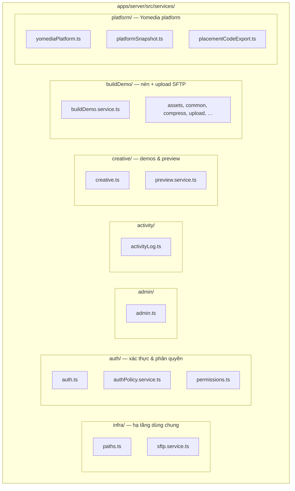
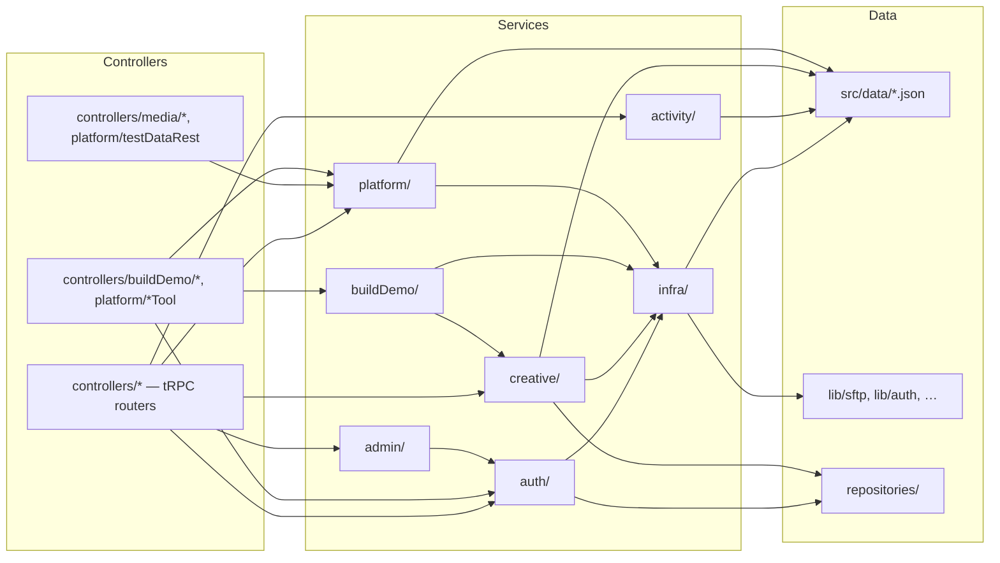
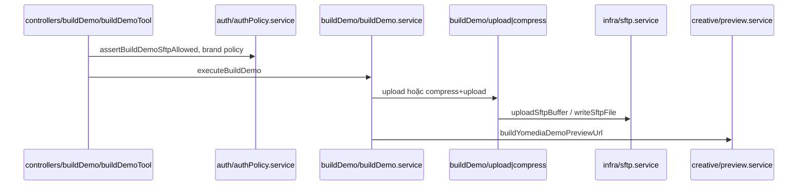
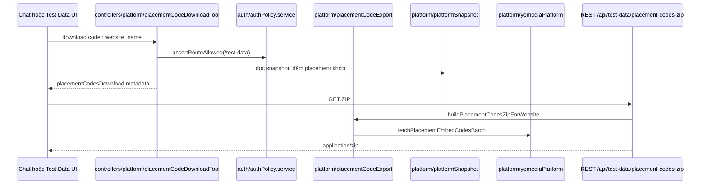

# Server — Services layer (`apps/server/src/services`)

Tài liệu mô tả cấu trúc **services** sau khi phân loại theo domain (thay vì để phẳng một thư mục).

> Build Demo chi tiết: [`server-build-demo-architecture.md`](./server-build-demo-architecture.md)  
> Chat / Supervisor: [`chat-agent-flow.md`](./chat-agent-flow.md)

---

## 1. Sơ đồ cây thư mục



---

## 2. Sơ đồ phụ thuộc giữa các domain



---

## 3. Bảng phân loại

| Thư mục | File chính | Trách nhiệm |
|---------|------------|-------------|
| **infra/** | `paths.ts`, `sftp.service.ts` | Đường dẫn file JSON (`creative-demos`, `platform-snapshot`, `role-permissions`); wrapper `lib/sftp` |
| **auth/** | `auth.ts`, `authPolicy.service.ts`, `permissions.ts` | Login local, policy route/brand/SFTP, role + `role-permissions.json` |
| **admin/** | `admin.ts` | Đồng bộ / quản lý account Clerk + local |
| **activity/** | `activityLog.ts` | Ghi & đọc `activity-log.json` |
| **creative/** | `creative.ts`, `preview.service.ts` | `creative-demos.json`, URL preview `demo.yomedia.vn` |
| **buildDemo/** | `buildDemo.service.ts` + modules con | Orchestrator Build Demo: normalize → nén → upload SFTP → preview |
| **platform/** | `yomediaPlatform.ts`, `platformSnapshot.ts`, `placementCodeExport.ts` | Crawl platform YO, lưu snapshot, export ZIP placement code |

---

## 4. Luồng tiêu biểu

### 4.1 Chat → Build Demo



### 4.2 Chat / Test Data → Tải placement code



---

## 5. Cấu trúc file (text)

```text
apps/server/src/services/
├── infra/
│   ├── paths.ts              # creativeDemosPath, platformSnapshotPath, rolePermissionsPath
│   └── sftp.service.ts         # Re-export lib/sftp
├── auth/
│   ├── auth.ts                 # loginWithEmailPassword, guest/user payload
│   ├── authPolicy.service.ts   # assertChatAccess, assertRouteAllowed, brand/SFTP ACL
│   └── permissions.ts          # role-permissions.json, allowedRoutes, buildDemo brands
├── admin/
│   └── admin.ts                # listAdminAccounts, Clerk sync
├── activity/
│   └── activityLog.ts          # append / list activity log
├── creative/
│   ├── creative.ts             # đọc creative-demos.json
│   └── preview.service.ts      # preview URL demo.yomedia.vn
├── buildDemo/
│   ├── buildDemo.service.ts    # orchestrator + formatBuildDemoChatAnswer
│   ├── assets.ts, common.ts, compress.ts, config.ts
│   ├── inlineImages.ts, upload.ts, vastXml.ts
└── platform/
    ├── yomediaPlatform.ts      # login platform, banner/placement grid, get code
    ├── platformSnapshot.ts     # đọc/ghi platform-snapshot.json
    └── placementCodeExport.ts  # lọc theo website_name → ZIP
```

---

## 6. Import path (ví dụ)

```ts
// Auth & permissions
import { assertChatAccess } from "../../services/auth/authPolicy.service.js";
import { getAllowedRoutesByRole } from "../../services/auth/permissions.js";

// Build Demo
import { executeBuildDemo } from "../../services/buildDemo/buildDemo.service.js";

// Platform / Test Data
import { fetchPlatformTestSnapshot } from "../../services/platform/yomediaPlatform.js";
import { readStoredPlatformSnapshot } from "../../services/platform/platformSnapshot.js";
import { buildPlacementCodesZipForWebsite } from "../../services/platform/placementCodeExport.js";

// Infra
import { creativeDemosPath } from "../../services/infra/paths.js";
import { uploadSftpBuffer } from "../../services/infra/sftp.service.js";
```

---

## 7. Ghi chú

- **LLM** (`callProvider`, `classifyIntent`) nằm ở `lib/ai/services/llm/`, không thuộc `src/services/`.
- REST SFTP (`controllers/media/sftp.ts`) gọi trực tiếp `lib/sftp`; `services/infra/sftp.service.ts` là wrapper cho Build Demo / preview.
- Cấu trúc controllers: [`server-controllers-architecture.md`](./server-controllers-architecture.md)
- File JSON data luôn resolve qua `infra/paths.ts` (đường dẫn tương đối `src/data/`).
