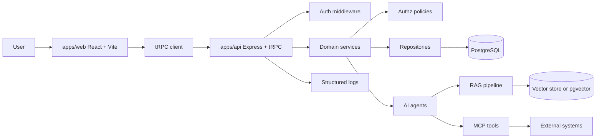
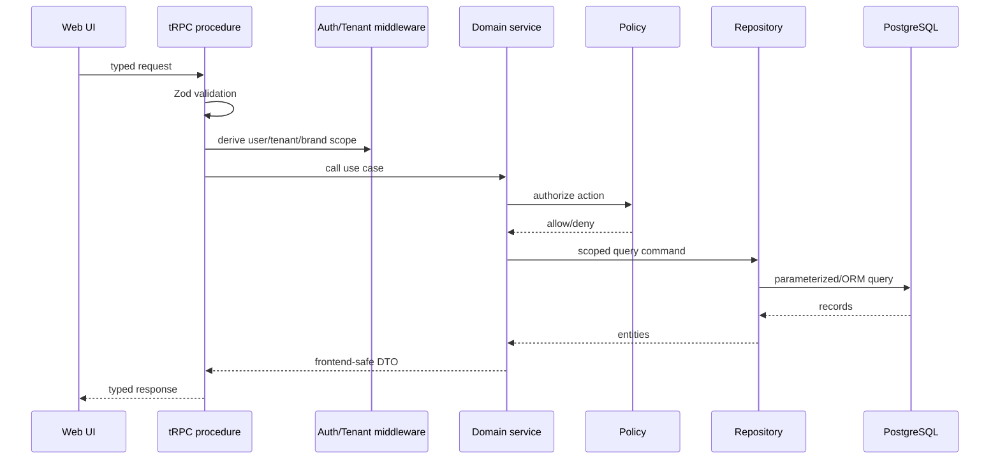
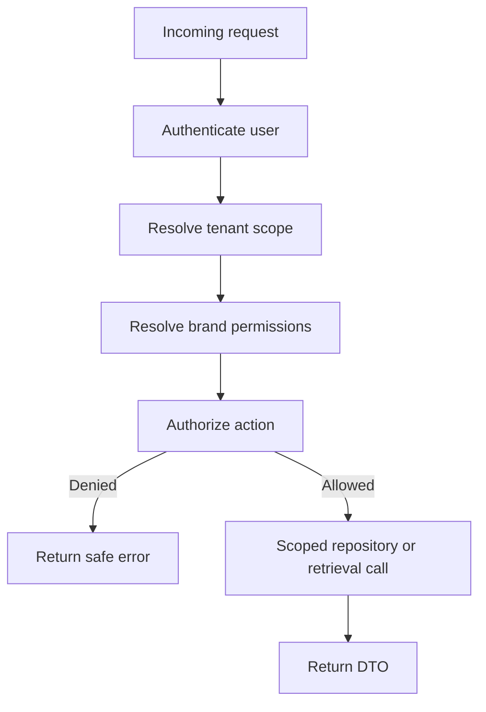
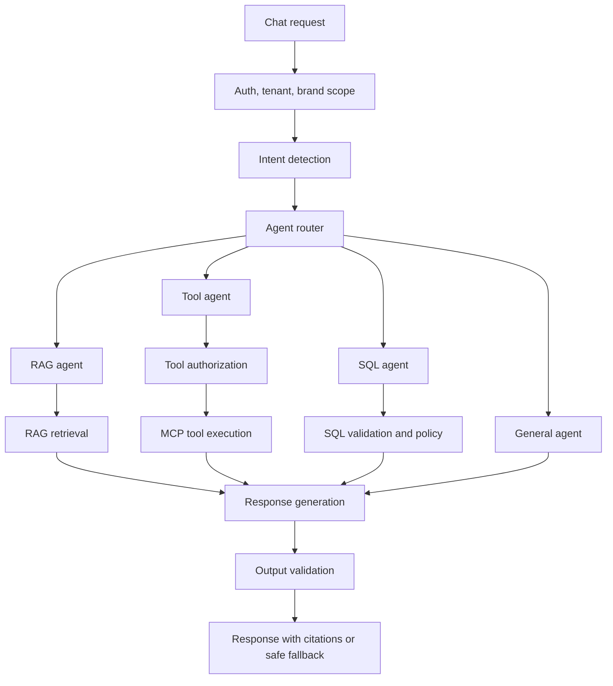
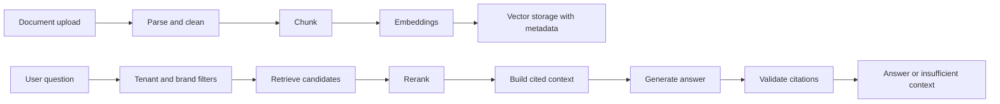

# System Architecture

## Purpose

Describe the full NewDashboardYomedia system at a high level so developers and AI agents can understand ownership boundaries before changing code.

## Scope

This document covers the monorepo system shape: frontend, backend, tRPC, services, repositories, PostgreSQL, authentication, authorization, multi-tenancy, brand permissions, AI orchestration, MCP tools, RAG, observability, testing, and deployment concerns. Detailed implementation guidance lives in the related architecture and standards documents.

## Overview

NewDashboardYomedia is a pnpm monorepo with a React + Vite frontend, an Express + tRPC backend, shared packages, PostgreSQL persistence, AI chatbot workflows, RAG, multi-agent routing, and MCP tool integrations.

## Frontend

`apps/web` is the UI layer. It renders DTOs, manages browser-safe state, performs UX-level validation, and calls the backend through tRPC or existing API helpers. It must not contain business logic, database access, AI provider clients, RAG pipelines, MCP clients, SQL execution, server secrets, or authorization decisions.

See `docs/architecture/frontend.md`.

## Backend

`apps/api` owns business workflows, authentication, authorization, tenant and brand scope, database access, AI orchestration, RAG, MCP tools, validation, logging, and frontend-safe DTOs.

See `docs/architecture/backend.md`.

## tRPC

tRPC routers live under `apps/api/src/trpc`. Procedures should validate input, derive authenticated context, call services, and return DTOs. They should remain thin and should not import database clients directly.

## Service Layer

Services in `apps/api/src/modules` implement business workflows. They can compose repositories, policies, AI services, RAG services, and backend utilities. Services must not depend on Express `Request` or `Response`.

## Repository Layer

Repositories own persistence and are the only normal path to database clients. Repository methods should require tenant and brand scope where data is scoped. Query methods should make authorization-relevant filters explicit.

## PostgreSQL

PostgreSQL is the source of truth for application data. Prisma schema files currently live under `apps/api/src/database/prisma`. Database access should be repository-mediated, transaction-aware, and indexed for tenant/brand scoped queries.

## Authentication

Authentication is resolved on the backend from trusted middleware and server-side token verification. The frontend can send credentials or session tokens through approved clients, but it cannot define trusted identity.

## Authorization

Policies enforce permissions before protected operations. Authorization must happen before database queries, RAG retrieval, external tool calls, and mutations.

## Multi-Tenancy

Tenant scope must come from authenticated backend context. Tenant filters must be applied before database access and retrieval. Client-provided tenant IDs are untrusted hints.

## Brand Permissions

Brand access must be recomputed or verified on the backend. Brand filters must be applied before data access, document retrieval, and generated answers.

## AI Orchestration

AI orchestration lives under `apps/api/src/ai`. The orchestrator classifies intent, selects agents, applies guardrails, calls RAG or tools, validates outputs, and returns safe responses.

See `docs/architecture/ai-agent.md`.

## Multi-Agent Routing

## MCP Tools

MCP clients, registries, adapters, and security controls live under `apps/api/src/mcp`. Tools must be allowlisted, argument-validated, authorized, and logged with sanitized summaries.

## RAG Ingestion

RAG ingestion loads files, parses text, cleans content, chunks documents, embeds chunks, and writes vectors with tenant, brand, document, source, and version metadata.

## Retrieval

Retrieval must filter by tenant and brand before ranking. Hybrid retrieval, reranking, and metadata filters should preserve document metadata, chunk IDs, scores, and source references for citations and evals.

## Citations

RAG responses must cite retrieved chunks. If retrieval lacks sufficient authorized context, the answer should say so rather than filling gaps with unsupported model knowledge.

## Observability

Use request IDs, run IDs, structured logs, sanitized error summaries, durations, and status fields. Agent step logs should follow the contract in `packages/observability`.

## Testing

Testing should cover services, policies, repositories, tRPC procedures, frontend UI, browser workflows, tenant isolation, brand isolation, RAG retrieval, citations, agent routing, and MCP tool authorization. See `docs/standards/testing.md`.

## Deployment

Docker files and compose files exist for deployment-oriented workflows. Production deployment must provide secrets through environment or secret managers, run database migrations deliberately, and keep optional model-based evals separate from deterministic checks.

See `docs/operations/deployment.md`.

## Related Documents

- `docs/architecture/frontend.md`
- `docs/architecture/backend.md`
- `docs/architecture/ai-agent.md`
- `docs/architecture/rag.md`
- `docs/data/database.md`
- `docs/standards/security.md`
- `docs/standards/testing.md`
