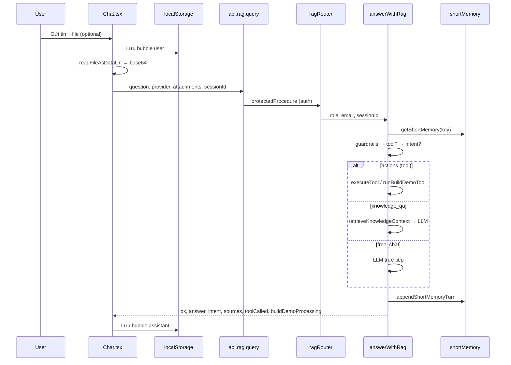
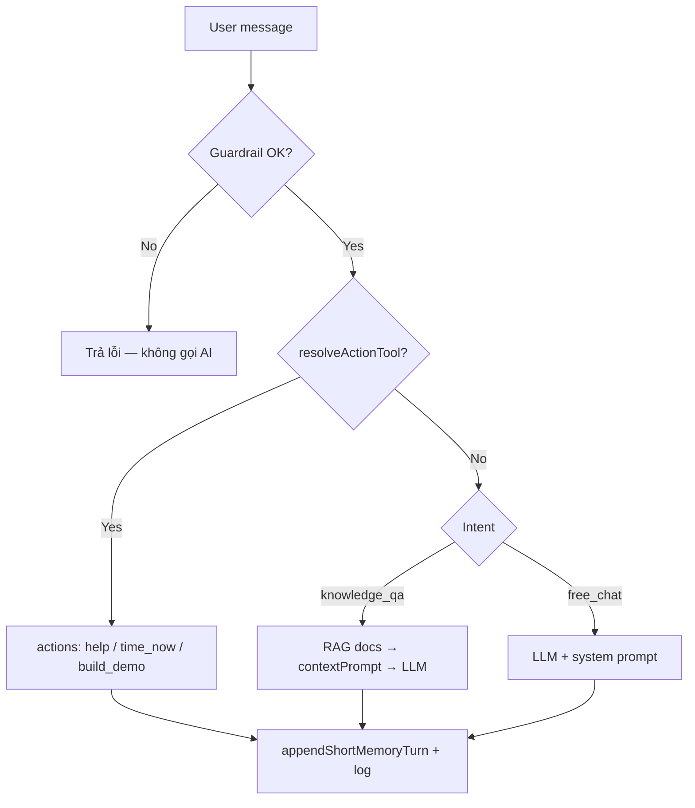
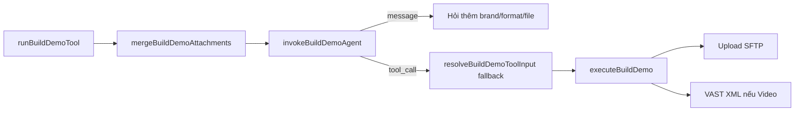

# Chat Agent — Luồng và xử lý chi tiết

**YoMedia Dashboard · NovaAI Assistant**  
*Tài liệu nội bộ · Cập nhật: 2026-06*

> Bản HTML/PDF in: [`chat-agent-flow.html`](./chat-agent-flow.html)

---

## 1. Tổng quan

Hệ thống chat AI hoạt động theo mô hình **request/response qua tRPC** (không streaming). Có **hai lớp bộ nhớ** tách biệt:

| Lớp | File / thành phần | Vai trò |
|-----|-------------------|---------|
| **Client** | `apps/web/components/Chat.tsx` | UI, lịch sử `localStorage`, chọn Gemini/OpenAI, đính kèm file/thư mục |
| **API** | `apps/web/lib/trpc/api.ts` → `rag.query` | Mutation có auth |
| **Server** | `answerWithRag` | Guardrails, routing tool/intent, RAG, LLM, short memory |

**Quan trọng:** Lịch sử bubble trên UI **không** đồng bộ tự động với ngữ cảnh LLM trên server. Xóa tin trên client hoặc refresh trang không xóa short memory — cần **Xóa phiên** hoặc `rag.clearSession`.

---

## 2. Luồng tổng thể

### 2.1 Sequence (end-to-end)



### 2.2 ASCII (tóm tắt)

```
User
  │
  ▼
Chat.tsx ──► localStorage (lưu message user)
  │
  ├── readFileAsDataUrl → base64 attachment (nếu có file/folder)
  │
  ▼
api.rag.query(question, provider, attachments, sessionId)
  │
  ▼
ragRouter (protectedProcedure) ──► email, role từ auth
  │
  ▼
answerWithRag(...)
  │
  ├── getShortMemory(email::sessionId)
  ├── guardrails → resolveActionTool → classify intent
  │
  ├─[actions / build_demo]──► runBuildDemoTool → agent → SFTP
  ├─[knowledge_qa]──────────► retrieveKnowledgeContext → LLM
  └─[free_chat]─────────────► LLM trực tiếp
  │
  ▼
appendShortMemoryTurn + logChatEvent
  │
  ▼
Response → Chat.tsx bubble assistant (+ BuildDemoProgress nếu UI nhận diện)
```

**`sessionId`** trên server = `activeConversation.id` trên client (ví dụ `c-1717...`).

---

## 3. Pipeline server (`answerWithRag`)

File: `apps/server/src/lib/ai/orchestration/answerWithRag.ts`

Thứ tự xử lý **cố định** mỗi request:

### 3.1 Guardrails

- Tin trống → từ chối  
- Độ dài > **1500** ký tự (`MAX_QUESTION_LENGTH`)  
- Chứa từ nhạy cảm: `password`, `token`, `api key`, `credit card`, …

→ Trả `{ ok: false, answer }`, **không** gọi AI.  
File: `apps/server/src/lib/ai/guardrails/index.ts`

### 3.2 Short memory (server)

- Key: `{email hoặc role:guest}::{sessionId hoặc default}` (`buildShortMemoryKey`)  
- TTL mặc định: **2 giờ** (`SHORT_MEMORY_TTL_MS`)  
- Tối đa **8 cặp** user/assistant (`MAX_HISTORY_TURNS`)  
- **Build Demo pending:** `buildDemoAttachments` lưu riêng, gộp qua `mergeBuildDemoAttachments` đến khi upload thành công → `clearBuildDemoAttachments`

File: `apps/server/src/lib/ai/memory/shortMemory.ts`

### 3.3 Phát hiện tool (ưu tiên cao nhất)

`resolveActionTool` (`detectTool.ts`) chạy **trước** LLM intent classifier:

| Tool | Trigger ví dụ |
|------|----------------|
| `help` | help, hướng dẫn, trợ giúp |
| `time_now` | mấy giờ, time now, giờ hiện tại |
| `build_demo` | build demo, upload, sftp, tải lên, tạo demo, … |

**Phiên Build Demo đang mở** (`isBuildDemoSessionActive`) — route `build_demo` khi **một trong**:

1. `hasBuildDemoAttachments(memoryKey)` — file đã gửi, chờ metadata  
2. History user đã có turn khớp `isDemoActionIntent`  
3. Assistant đã hỏi brand/format/upload **và** còn turn user sau đó  

→ User có thể trả lời "Vinamilk", "video" mà không cần lặp từ khóa build demo.

```ts
// detectTool.ts — thứ tự
const direct = detectTool(text);
if (direct) return direct;
if (isBuildDemoSessionActive({ history, hasPendingAttachments })) {
  return "build_demo";
}
```

### 3.4 Phân loại intent (khi không có tool)

1. **LLM classifier** (`classifyIntentWithLlm`) → JSON `{ intent: knowledge_qa | free_chat, confidence, reason }`  
2. LLM lỗi → **rule-based** `classifyUserIntent`  
3. Có tool → `intent: actions`, `classifierSource: rule_tool`

**Lưu ý:** Intent LLM **không** chạy khi đã match tool. Câu hỏi SOP vẫn có thể thành `build_demo` nếu phiên demo đang active.

### 3.5 Ba nhánh xử lý

| Intent | Hành vi |
|--------|---------|
| **actions** | `executeTool` (`help`, `time_now`) hoặc `runBuildDemoTool` |
| **knowledge_qa** | Score doc trong `apps/server/rag/docs` → `contextPrompt` → LLM |
| **free_chat** | LLM + `getSystemPrompt()`, không RAG |

### 3.6 Gọi model & fallback

- Provider request: `gemini` (mặc định) hoặc `openai` (user chọn trên UI)  
- Model: `GEMINI_CHAT_MODEL` / `OPENAI_CHAT_MODEL` hoặc mặc định `gemini-1.5-flash` / `gpt-4o-mini`  
- Provider chính lỗi → thử provider còn lại → `fallbackUsed: true`, `usedProvider` trong response  

History LLM: `getShortMemory` + tin user hiện tại (chat/RAG); classifier LLM dùng history rỗng.

### 3.7 Logging

`logChatEvent`: `chat_guardrail_block`, `chat_tool_called`, `chat_query`, `chat_provider_failed`, `chat_clear_history`

---

## 4. Sơ đồ quyết định routing



```
User message
    │
    ├─ Guardrail fail ──────────────► Trả lỗi
    │
    ├─ resolveActionTool ≠ null ───► actions → tool
    │
    ├─ LLM classify (ưu tiên knowledge_qa khi mơ hồ)
    │       └─ fail → rule classifyUserIntent
    │
    ├─ knowledge_qa → RAG docs → LLM
    └─ free_chat ─────────────────► LLM trực tiếp
```

---

## 5. Nhánh Build Demo

### 5.1 Luồng server



```
runBuildDemoTool
  │
  ├─ mergeBuildDemoAttachments(memoryKey, attachments)
  │
  ├─ invokeBuildDemoAgent (OpenAI/Gemini function calling: build_demo)
  │     ├─ kind: message → trả text hỏi thêm
  │     └─ kind: tool_call → { brandId, productCateId, demoFormat, folderName? }
  │
  ├─ Nếu chưa đủ → resolveBuildDemoToolInput (rule fallback từ history)
  │
  └─ executeBuildDemo
        ├─ Validate brand (admin = null → mọi brand)
        ├─ Decode base64 attachments
        ├─ Upload SFTP: /script/demo/{year}/{month}/...
        ├─ Video: makeVastXml.ts
        └─ HTML: inline images (buildDemoInlineImages.ts) nếu cần
```

**Quyền brand:** `admin` → `allowedBrands: null`; user → `resolveAllowedBuildDemoBrands(account)`.

**Thành công:** answer bắt đầu bằng `Build Demo thành công` → `clearBuildDemoAttachments`.

**Response:** `buildDemoProcessing: true` khi `executeBuildDemo` thực sự chạy (`executed: true` trong `buildDemoTool.ts`).

### 5.2 Build Demo nhiều lượt

| Lượt | User gửi | Server |
|------|----------|--------|
| 1 | Chọn folder/file | `mergeBuildDemoAttachments` — giữ file |
| 2 | Brand, format (text) | Agent/rule trích metadata |
| 3 | (optional) Bổ sung | Agent hỏi hoặc gọi tool |

File pending trên server độc lập với `selectedUploads` trên client sau khi gửi thành công một lượt.

### 5.3 Files liên quan

| File | Vai trò |
|------|---------|
| `buildDemoTool.ts` | Orchestration: agent → execute → clear attachments |
| `buildDemoAgent.ts` | Function calling, extraction metadata |
| `buildDemoExecutor.ts` | SFTP, ghi creative-demos, VAST |
| `buildDemoConfig.ts` | Brand / product category |
| `buildDemoInlineImages.ts` | Embed ảnh vào HTML demo |
| `apps/web/lib/buildDemoBrands.ts` | Brand options cho UI progress |
| `apps/web/lib/buildDemoChatProgress.ts` | Điều kiện hiện progress bar |

---

## 6. Client (`Chat.tsx`)

### 6.1 Gửi tin (`handleSend`)

1. Validate: text hoặc file; không gửi khi `isSending`  
2. Tạo bubble user; nếu có file → suffix `[Files: ...]`  
3. `readFileAsDataUrl` → `attachments[]` (base64)  
4. `api.rag.query(text || "upload demo", provider, attachments, activeConversation.id)`  
5. Bubble assistant từ `res.answer`; lỗi → bubble `system` qua `handleApiError`  

### 6.2 BuildDemoProgress (chỉ UI)

Thanh tiến độ **giả lập** (interval ~450ms, max ~92%) khi `shouldShowBuildDemoProgress` = true:

- Có file trong phiên (đang chọn hoặc `[Files:` trong history)  
- Corpus hội thoại có **brand** nhận diện được  
- Corpus có hint **format** (html/video/mp4…)  

Khi server trả `buildDemoProcessing: true` → đẩy 100%, ẩn sau ~600ms.

**Không** phản ánh tiến trình SFTP thật — một response khi server xong.

### 6.3 Bộ nhớ & quản lý hội thoại

| Loại | Nơi lưu | Mục đích |
|------|---------|----------|
| Conversations | `localStorage` `yomedia.chat.conversations.v1` | UI, max **30** hội thoại |
| Short memory | Server RAM `Map` | Context LLM (8 turn) |
| Pending Build Demo files | Server `buildDemoAttachments` | File nhiều lượt |

- **Refresh trang:** tạo conversation mới (sidebar "Hội thoại cũ")  
- **Xóa phiên:** reset messages + `rag.clearSession({ sessionId })`  
- **Xóa cũ:** xóa conversations khác + `clearSession` từng id  

### 6.4 Đính kèm

- Nút **Folder**: `webkitdirectory` — merge qua `mergeChatUploads` (`chatAttachments.ts`)  
- File gửi kèm mỗi request; không persist base64 trên client sau send thành công  

---

## 7. RAG (Knowledge Base)

File: `apps/server/src/lib/ai/retrieval/knowledgeBase.ts`

1. Load **`.md`**, **`.txt`**, **`.json`** từ `apps/server/rag/docs` (cache in-memory)  
2. **scoreDoc**: khớp keyword câu hỏi với nội dung doc  
3. Top **3** doc, extract snippet theo dòng liên quan  
4. Ghép `contextPrompt` → đưa vào LLM  

Nếu không có doc / không match → `fallbackMessage` trong prompt.

> **PDF** trong `rag/docs` hiện **không** được index bởi `knowledgeBase.ts` (chỉ md/txt/json).

---

## 8. API tRPC

**Router:** `apps/server/src/trpc/routers/rag.ts`

| Procedure | Mô tả |
|-----------|--------|
| `rag.query` | mutation — xử lý chat (protected) |
| `rag.clearSession` | xóa short memory một session hoặc `allSessions` theo user prefix |

### Input `rag.query`

| Field | Kiểu | Ghi chú |
|-------|------|---------|
| `question` | string | Bắt buộc |
| `sessionId` | string? | Max 128, = conversation id |
| `provider` | `gemini` \| `openai`? | |
| `attachments` | array? | name, relativePath, size, mimeType, contentBase64 |

### Output (`RagAnswerResult`)

| Field | Ý nghĩa |
|-------|---------|
| `ok` | Thành công logic (guardrail block → `ok: false`) |
| `answer` | Nội dung trả lời |
| `provider` | Provider thực tế dùng (sau fallback) |
| `intent` | `actions` \| `knowledge_qa` \| `free_chat` |
| `sources` | Tên doc RAG (nếu có) |
| `toolCalled` | `help` \| `time_now` \| `build_demo` |
| `buildDemoProcessing` | `true` khi SFTP/execute chạy |
| `fallbackUsed` | Đã đổi provider |

---

## 9. Bản đồ file

| Thành phần | Đường dẫn |
|------------|-----------|
| UI Chat | `apps/web/components/Chat.tsx` |
| Message render | `apps/web/components/ChatMessageContent.tsx` |
| Build Demo progress UI | `apps/web/components/BuildDemoProgress.tsx` |
| Progress heuristic | `apps/web/lib/buildDemoChatProgress.ts` |
| Attachments client | `apps/web/lib/chatAttachments.ts` |
| API client | `apps/web/lib/trpc/api.ts` |
| Router | `apps/server/src/trpc/routers/rag.ts` |
| Orchestrator | `apps/server/src/lib/ai/orchestration/answerWithRag.ts` |
| Tool routing | `apps/server/src/lib/ai/actions/detectTool.ts` |
| Actions index | `apps/server/src/lib/ai/actions/index.ts` |
| Build Demo tool | `apps/server/src/lib/ai/actions/buildDemoTool.ts` |
| Build Demo agent | `apps/server/src/lib/ai/actions/buildDemoAgent.ts` |
| Build Demo executor | `apps/server/src/lib/ai/actions/buildDemoExecutor.ts` |
| Intent (rule) | `apps/server/src/lib/ai/intent/classifyUserIntent.ts` |
| RAG retrieval | `apps/server/src/lib/ai/retrieval/knowledgeBase.ts` |
| Short memory | `apps/server/src/lib/ai/memory/shortMemory.ts` |
| Guardrails | `apps/server/src/lib/ai/guardrails/index.ts` |
| Config / prompt | `apps/server/src/lib/ai/core/config.ts` |
| Types | `apps/server/src/lib/ai/core/types.ts` |

---

## 10. Biến môi trường

| Biến | Mục đích |
|------|----------|
| `OPENAI_API_KEY` | Chat + Build Demo agent (OpenAI) |
| `GEMINI_API_KEY` | Chat + Build Demo agent (Gemini) |
| `OPENAI_CHAT_MODEL` | Model OpenAI chat |
| `GEMINI_CHAT_MODEL` | Model Gemini chat |
| `CHAT_SYSTEM_PROMPT` | System prompt tùy chỉnh |
| `SHORT_MEMORY_TTL_MS` | TTL short memory (ms) |

---

## 11. Gỡ lỗi thường gặp

| Triệu chứng | Nguyên nhân có thể |
|-------------|-------------------|
| AI "quên" ngữ cảnh sau refresh | Client mất UI history; server memory còn — hoặc ngược lại nếu đổi sessionId |
| Mọi câu đều Build Demo | `isBuildDemoSessionActive` — cần **Xóa phiên** hoặc hoàn tất/hủy flow |
| Progress bar nhưng không upload | `shouldShowBuildDemoProgress` true nhưng agent chưa gọi `executeBuildDemo` (thiếu metadata) |
| RAG không trả doc PDF | Retrieval chỉ index md/txt/json |
| Provider lỗi | Thiếu API key hoặc cả hai provider fail — xem `chat_provider_failed` log |

---

*Tài liệu đồng bộ với codebase YoMedia Dashboard · `docs/chat-agent-flow.md`*
