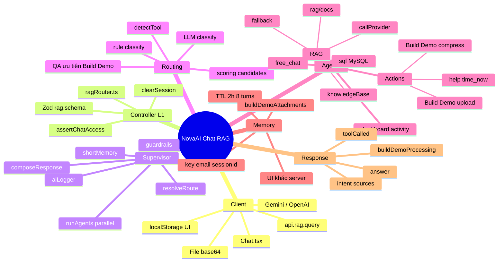
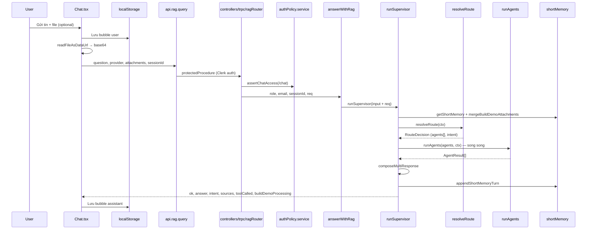
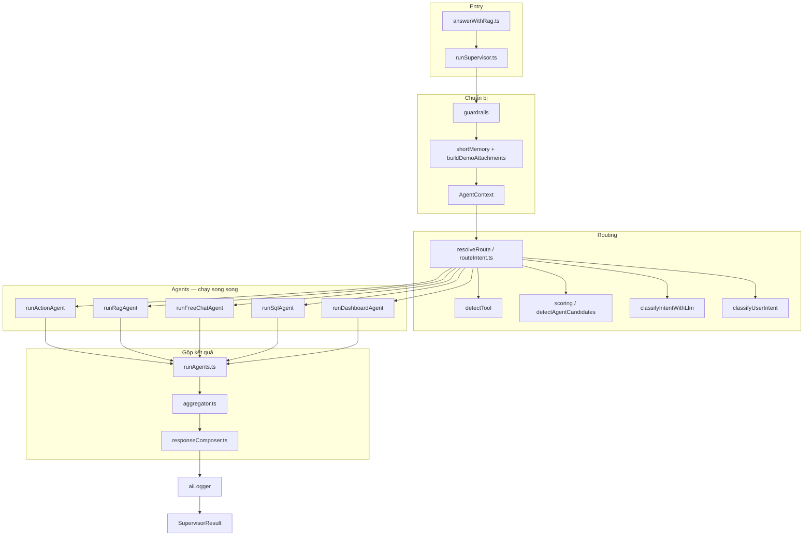
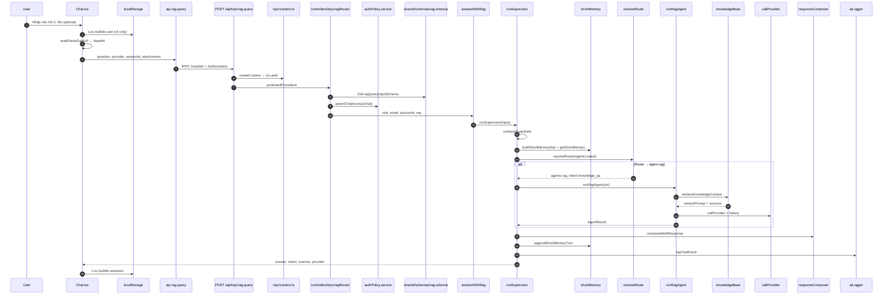
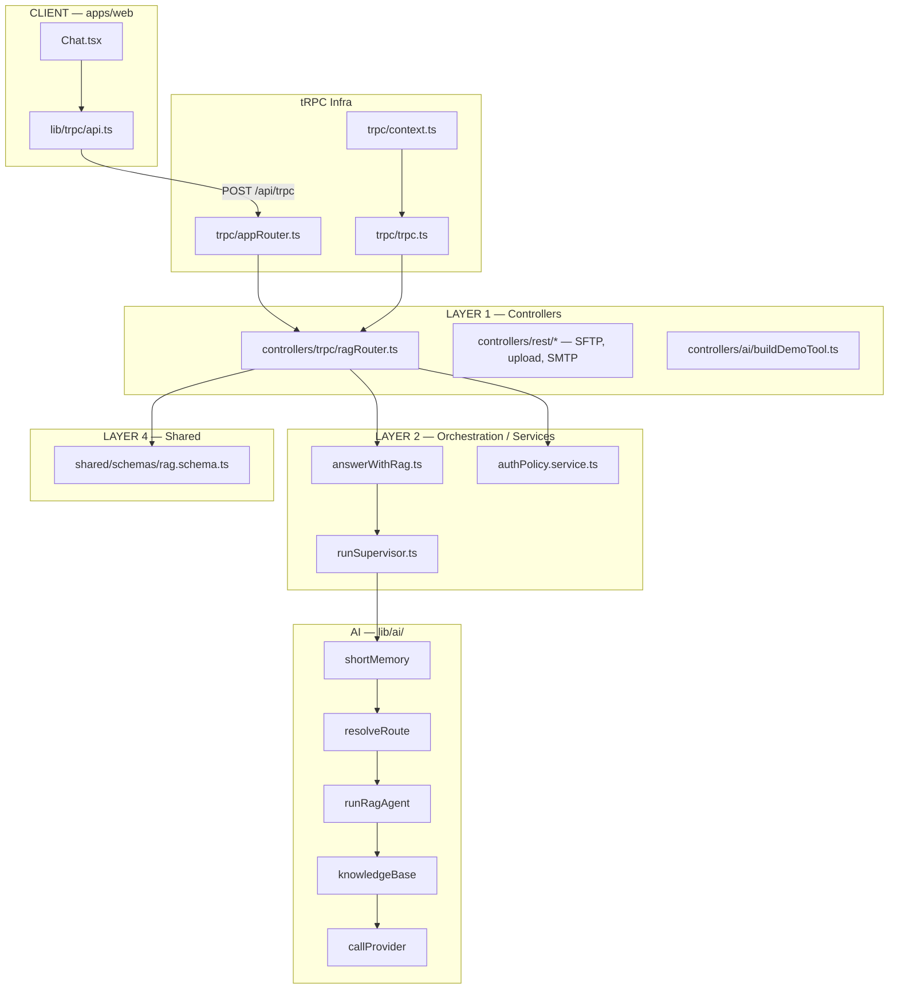
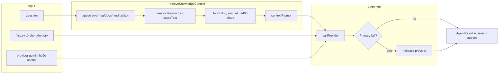
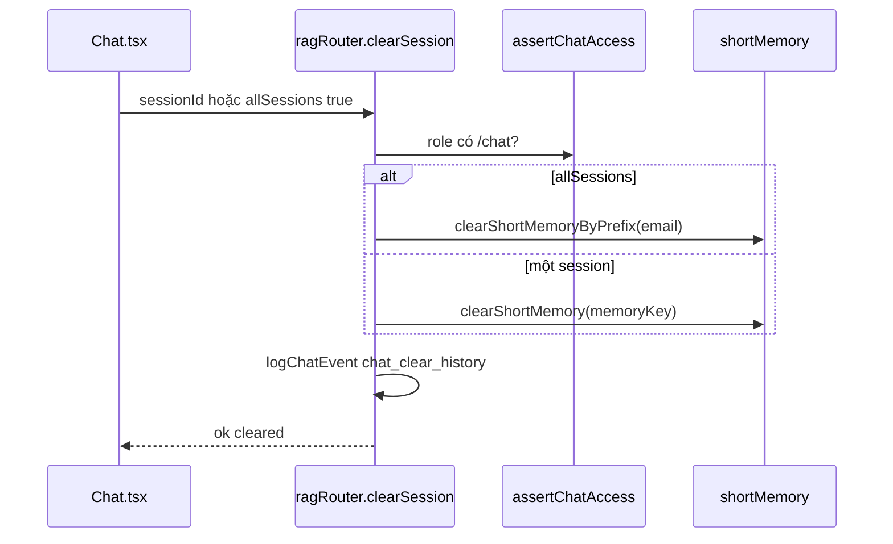
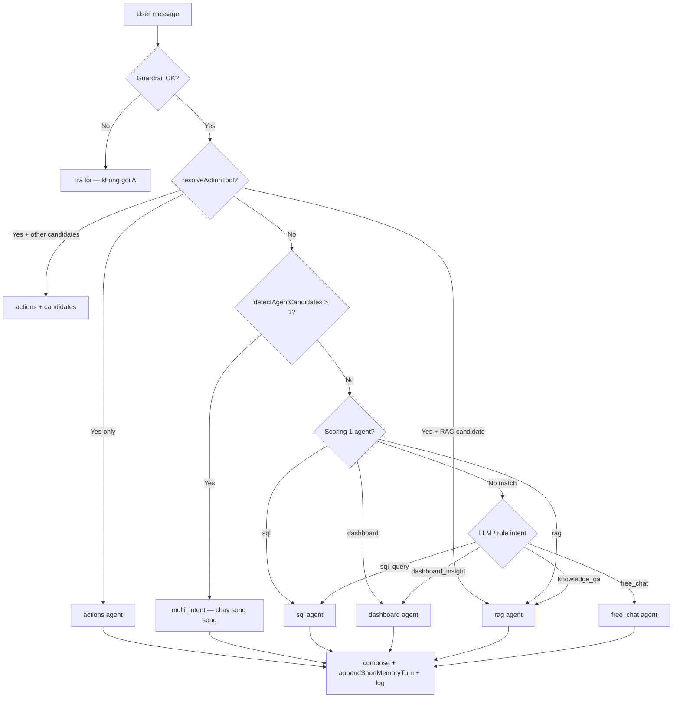
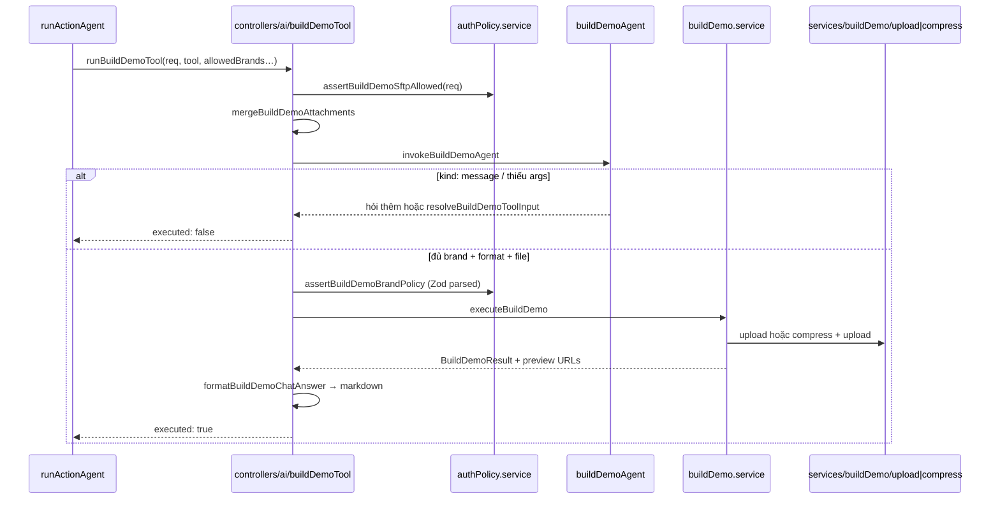

# Chat Agent — Luồng và xử lý chi tiết

**YoMedia Dashboard · NovaAI Assistant**  
*Tài liệu nội bộ · Cập nhật: 2026-06-08*

> Bản HTML/PDF in: [`chat-agent-flow.html`](./chat-agent-flow.html) · Mind map: [`chat-agent-mindmap.pdf`](./chat-agent-mindmap.pdf)  
> Kiến trúc Build Demo 4 lớp: [`server-build-demo-architecture.md`](./server-build-demo-architecture.md)

---

## 1. Tổng quan

Hệ thống chat AI hoạt động theo mô hình **request/response qua tRPC** (không streaming), với kiến trúc **Supervisor → Router → Agents → Composer**.

| Lớp | File / thành phần | Vai trò |
|-----|-------------------|---------|
| **Client** | `apps/web/components/Chat.tsx` | UI, lịch sử `localStorage`, chọn Gemini/OpenAI, đính kèm file/thư mục |
| **API** | `apps/web/lib/trpc/api.ts` → `rag.query` | Mutation có auth (Clerk Bearer) |
| **Controller** | `controllers/trpc/ragRouter.ts` | Zod input + `assertChatAccess(/chat)` + gọi `answerWithRag` |
| **Entry** | `answerWithRag` | Wrapper mỏng, gọi `runSupervisor` (truyền `req` cho Build Demo ACL) |
| **Supervisor** | `runSupervisor` | Guardrails, memory, routing, chạy agent(s), gộp response, log |

**Quan trọng:** Lịch sử bubble trên UI **không** đồng bộ tự động với ngữ cảnh LLM trên server. Xóa tin trên client hoặc refresh trang không xóa short memory — cần **Xóa phiên** hoặc `rag.clearSession`.

### 1.1 Mind map — tổng quan hệ thống

> Bản HTML/PDF mind map: [`chat-agent-mindmap.html`](./chat-agent-mindmap.html) · [`chat-agent-mindmap.pdf`](./chat-agent-mindmap.pdf)



---

## 2. Luồng tổng thể

### 2.1 Sequence (end-to-end)



### 2.2 Kiến trúc server (Supervisor pattern)



### 2.3 ASCII (tóm tắt)

```
User
  │
  ▼
Chat.tsx ──► localStorage (lưu message user)
  │
  ├── readFileAsDataUrl → base64 attachment (nếu có file/folder)
  │
  ▼
api.rag.query(question, provider, attachments, sessionId)
  │
  ▼
controllers/trpc/ragRouter (protectedProcedure + Zod)
  │
  ├── assertChatAccess(req) — role phải có route /chat
  ▼
answerWithRag → runSupervisor(req, role, email…)
  │
  ├── guardrails
  ├── getShortMemory + mergeBuildDemoAttachments
  ├── resolveRoute → agents[] (1 hoặc nhiều)
  ├── runAgents (Promise.all — song song)
  ├── composeMultiResponse (rank + merge)
  ├── appendShortMemoryTurn + logChatEvent
  │
  ▼
Response → Chat.tsx bubble assistant (+ BuildDemoProgress nếu UI nhận diện)
```

**`sessionId`** trên server = `activeConversation.id` trên client (ví dụ `c-1717...`).

### 2.4 Sequence end-to-end chi tiết (4 lớp + nhánh RAG)



### 2.5 Kiến trúc 4 lớp (sau refactor `controllers/`)



| Lớp | Thư mục | Trách nhiệm |
|-----|---------|-------------|
| **L1 Controller** | `controllers/trpc/`, `controllers/rest/`, `controllers/ai/` | Validate Zod, auth/policy, gọi service/orchestrator |
| **L2 Service** | `services/`, `lib/ai/orchestration/` | Business logic, supervisor, policy |
| **L3 Repository** | `repositories/` | Đọc/ghi data (JSON file) |
| **L4 Shared** | `shared/schemas/` | Zod schema dùng chung |

### 2.6 Nhánh RAG — retrieval → LLM



**Khi nào route vào RAG** (`resolveRoute`):

| Điều kiện | Kết quả |
|-----------|---------|
| Tool Build Demo + candidate `rag` | Chỉ `rag` — QA ưu tiên phiên demo |
| `detectAgentCandidates` = rag | `agents: ["rag"]` |
| LLM/rule → `knowledge_qa` | `agents: ["rag"]` |
| Multi-intent có rag | Chạy song song với agents khác |

### 2.7 `rag.clearSession` — xóa memory server



**Request `rag.query`:**

| Field | Mô tả |
|-------|--------|
| `question` | Bắt buộc |
| `provider` | `gemini` \| `openai` (mặc định gemini) |
| `sessionId` | Phân tách short memory theo hội thoại |
| `attachments` | File base64 (Build Demo; RAG thuần thường không cần) |

**Response khi RAG:**

| Field | Ý nghĩa |
|-------|---------|
| `answer` | Câu trả lời LLM (có context từ docs) |
| `intent` | `knowledge_qa` hoặc `multi_intent` |
| `sources` | Tên file doc được retrieve |
| `fallbackUsed` | Đã đổi provider khi primary lỗi |

---

## 3. Pipeline server (`runSupervisor`)

File chính: `apps/server/src/lib/ai/agents/supervisor/runSupervisor.ts`  
Entry point: `apps/server/src/lib/ai/orchestration/answerWithRag.ts` (wrapper)

Thứ tự xử lý **cố định** mỗi request:

### 3.1 Guardrails

- Tin trống → từ chối  
- Độ dài > **1500** ký tự (`MAX_QUESTION_LENGTH`)  
- Chứa từ nhạy cảm: `password`, `token`, `api key`, `credit card`, …

→ Trả `{ ok: false, answer }`, **không** gọi AI.  
File: `apps/server/src/lib/ai/guardrails/index.ts`

### 3.2 Short memory (server)

- Key: `{email hoặc role:guest}::{sessionId hoặc default}` (`buildShortMemoryKey`)  
- TTL mặc định: **2 giờ** (`SHORT_MEMORY_TTL_MS`)  
- Tối đa **8 cặp** user/assistant (`MAX_HISTORY_TURNS`)  
- **Build Demo pending:** `buildDemoAttachments` lưu riêng, gộp qua `mergeBuildDemoAttachments` đến khi upload thành công → `clearBuildDemoAttachments`

File: `apps/server/src/lib/ai/memory/shortMemory.ts`

### 3.3 Routing (`resolveRoute`)

File: `apps/server/src/lib/ai/agents/router/routeIntent.ts`

Thứ tự ưu tiên (theo `routeIntent.ts`):

| Bước | Điều kiện | Kết quả |
|------|-----------|---------|
| 1a | `resolveActionTool` **và** `detectAgentCandidates` có `rag` | **Chỉ `rag`** — Knowledge QA ưu tiên hơn phiên Build Demo đang mở |
| 1b | `resolveActionTool` **và** có candidate khác | `multi_intent`: `["actions", …candidates]`, `source: rule_multi` |
| 1c | Chỉ `resolveActionTool` | `agents: ["actions"]`, `source: rule_tool` |
| 2 | `detectAgentCandidates` > 1 (không tool) | `multi_intent`, `source: rule_multi` |
| 3 | Scoring 1 agent | `sql` / `dashboard` / `rag`, `source: rule_fallback` |
| 4 | `classifyIntentWithLlm` → `classifyUserIntent` | `rag` / `free_chat` / `sql` / `dashboard`, `source: llm` hoặc `rule_fallback` |

**Intent types** (`core/types.ts`):

| Intent | Agent(s) |
|--------|----------|
| `actions` | `actions` |
| `knowledge_qa` | `rag` |
| `free_chat` | `free_chat` |
| `sql_query` | `sql` |
| `dashboard_insight` | `dashboard` |
| `multi_intent` | Nhiều agent song song |

### 3.4 Phát hiện tool

`resolveActionTool` (`tools/detectTool.ts`) được gọi **cùng lúc** với `detectAgentCandidates` trong `resolveRoute`. Tool không luôn thắng: nếu câu hỏi cũng match Knowledge QA (scoring ≥ `RAG_THRESHOLD`), router chọn **rag** thay vì actions.

| Tool | Trigger ví dụ |
|------|----------------|
| `help` | help, hướng dẫn, trợ giúp |
| `time_now` | mấy giờ, time now, giờ hiện tại |
| `compress_demo_assets` | build demo, nén, compress, tvc, tạo demo, … |
| `upload_sftp_demo` | upload, sftp, tải lên, gửi file, … |

**Phiên Build Demo đang mở** (`isBuildDemoSessionActive`) — route demo khi **một trong**:

1. `hasBuildDemoAttachments(memoryKey)` — file đã gửi, chờ metadata  
2. History user đã có turn khớp compress/upload intent  
3. Assistant đã hỏi brand/format/upload **và** còn turn user sau đó  

→ User có thể trả lời "Vinamilk", "video" mà không cần lặp từ khóa build demo.

```ts
// detectTool.ts — thứ tự
const direct = detectTool(text);
if (direct) return direct;
if (hasIncomingAttachments) return "upload_sftp_demo";
if (isBuildDemoSessionActive(...)) {
  if (scoreKnowledgeQaIntent(text) >= RAG_THRESHOLD) return null; // QA ưu tiên
  return "compress_demo_assets";
}
```

Trong `resolveRoute`, nếu `resolveActionTool` **và** `detectAgentCandidates` có `rag` → chỉ chạy **rag** (bước 1a). Đây là lớp bảo vệ thứ hai khi user hỏi kiến thức giữa phiên Build Demo.

### 3.5 Chạy agents

File: `apps/server/src/lib/ai/orchestration/runAgents.ts`

Các agent được gọi **song song** (`Promise.all`) khi routing trả nhiều agent.

| Agent | File | Mô tả |
|-------|------|-------|
| `actions` | `agents/actions/runActionAgent.ts` | Tool: help, time_now, build demo |
| `rag` | `agents/rag/runRagAgent.ts` | RAG docs → LLM |
| `free_chat` | `agents/freeChat/runFreeChatAgent.ts` | LLM trực tiếp |
| `sql` | `agents/sql/runSqlAgent.ts` | LLM sinh SQL → MySQL whitelist |
| `dashboard` | `agents/dashboard/runDashboardAgent.ts` | Activity log → LLM tóm tắt |
| `search` | — | Chưa triển khai |

### 3.6 Gộp response

File: `apps/server/src/lib/ai/orchestration/responseComposer.ts` + `aggregator.ts`

- `rankAgentResults`: xếp hạng theo ok + confidence + sources  
- `mergeAgentAnswers`: nhiều agent → ghép `### SQL`, `### Dashboard`, …  
- Trả `SupervisorResult` gồm `trace` (requestId, route, spans, totalMs)

### 3.7 Gọi model & fallback

- Provider request: `gemini` (mặc định) hoặc `openai` (user chọn trên UI)  
- Model: `GEMINI_CHAT_MODEL` / `OPENAI_CHAT_MODEL` hoặc mặc định trong `core/config.ts`  
- Provider chính lỗi → thử provider còn lại → `fallbackUsed: true`  
- File gọi LLM: `services/llm/callProvider.ts`

### 3.8 Logging

`logChatEvent`: `chat_guardrail_block`, `chat_tool_called`, `chat_query`, `chat_provider_failed`, `chat_clear_history`

File: `apps/server/src/lib/ai/logging/aiLogger.ts`

---

## 4. Sơ đồ quyết định routing



---

## 5. Chi tiết từng agent

### 5.1 Actions Agent

File: `apps/server/src/lib/ai/agents/actions/runActionAgent.ts`

| Tool | Xử lý |
|------|-------|
| `help`, `time_now` | `executeTool()` — trả text tĩnh |
| `upload_sftp_demo` | `controllers/ai/buildDemoTool` → `services/buildDemo.service` (upload) |
| `compress_demo_assets` | `controllers/ai/buildDemoTool` → `services/buildDemo.service` (compress) |

Quyền brand: `admin` → `allowedBrands: null`; user → `resolveAllowedBuildDemoBrands(account)`.

Build Demo yêu cầu `ctx.req` trên `AgentContext` (truyền từ `ragRouter`). Thiếu `req` → trả *"Không thể chạy Build Demo: thiếu request context."*

### 5.2 RAG Agent

File: `apps/server/src/lib/ai/agents/rag/runRagAgent.ts`

1. `retrieveKnowledgeContext(question)` — score doc trong `apps/server/rag/docs`  
2. Ghép `contextPrompt` → `callProvider` với history  
3. Trả `sources[]` (tên file doc)

### 5.3 Free Chat Agent

File: `apps/server/src/lib/ai/agents/freeChat/runFreeChatAgent.ts`

- `callProvider(provider, question, history)` — không RAG

### 5.4 SQL Agent

File: `apps/server/src/lib/ai/agents/sql/runSqlAgent.ts`

1. Kiểm tra role (`sqlAllowedRoles`)  
2. Kiểm tra MySQL configured  
3. LLM sinh `SELECT` JSON → `executeMysqlQuery` (whitelist tables)  
4. Format kết quả markdown table

Tools: `tools/mysql/queryExecutor.ts`, `validateQuery.ts`, `whitelist.ts`

### 5.5 Dashboard Agent

File: `apps/server/src/lib/ai/agents/dashboard/runDashboardAgent.ts`

1. `summarizeActivityDashboard` — đọc `activity-log.json`  
2. `formatDashboardSummary` → prompt LLM tóm tắt tiếng Việt

Tools: `tools/analytics/activitySummary.ts`

---

## 6. Nhánh Build Demo

### 6.1 Hai loại tool

| Tool | Mục đích |
|------|----------|
| `upload_sftp_demo` | Upload file user lên SFTP **không** nén/inlined base64 |
| `compress_demo_assets` | Nén ảnh (base64 trong JS/HTML) hoặc video (~4MB) rồi upload |

### 6.2 Luồng server (4 lớp)



```
controllers/ai/buildDemoTool.ts          # LAYER 1 — validate + policy + format markdown
  ├─ assertBuildDemoSftpAllowed(req)
  ├─ mergeBuildDemoAttachments
  ├─ lib/ai/tools/buildDemo/buildDemoAgent.ts  # LLM function calling (không SFTP)
  ├─ buildDemoInputSchema.parse (shared/schemas)
  ├─ assertBuildDemoBrandPolicy
  └─ services/buildDemo.service.ts       # LAYER 2 — orchestrator
        ├─ intent upload_sftp → services/buildDemo/upload.ts
        ├─ intent compress → services/buildDemo/compress.ts (+ inlineImages, assets)
        ├─ path: services/buildDemo/common.ts
        ├─ video: services/buildDemo/vastXml.ts
        └─ preview: services/preview.service.ts
```

**Thành công:** answer bắt đầu bằng `Build Demo thành công` → `clearBuildDemoAttachments`.  
**Response:** `buildDemoProcessing: true` khi controller gọi `executeBuildDemo` (kể cả khi upload fail — `executed: true` nghĩa là đã chạy pipeline SFTP).

### 6.3 Build Demo nhiều lượt

| Lượt | User gửi | Server |
|------|----------|--------|
| 1 | Chọn folder/file | `mergeBuildDemoAttachments` — giữ file |
| 2 | Brand, format (text) | Agent/rule trích metadata |
| 3 | (optional) Bổ sung | Agent hỏi hoặc gọi tool |

---

## 7. Client (`Chat.tsx`)

### 7.1 Gửi tin (`handleSend`)

1. Validate: text hoặc file; không gửi khi `isSending`  
2. Tạo bubble user; nếu có file → suffix `[Files: ...]`  
3. `readFileAsDataUrl` → `attachments[]` (base64)  
4. `api.rag.query(text || "upload demo", provider, attachments, activeConversation.id)`  
5. Bubble assistant từ `res.answer`; lỗi → bubble `system` qua `handleApiError`  

### 7.2 BuildDemoProgress (chỉ UI)

Thanh tiến độ **giả lập** khi `shouldShowBuildDemoProgress` = true — heuristic client: **file trong session** + **brand** + **format** (HTML/Video) trong corpus hội thoại (`lib/buildDemoChatProgress.ts`).

- Bắt đầu khi gửi tin (heuristic): 8% → tăng dần tới 92% (mỗi 450ms)
- Khi server trả `buildDemoProcessing: true` → đẩy 100%, giữ ~600ms rồi ẩn
- Heuristic true nhưng `buildDemoProcessing: false` → ẩn ngay (agent chưa chạy SFTP — thiếu metadata)
- Heuristic false nhưng `buildDemoProcessing: true` → hiện progress ngắn 90% → 100% rồi ẩn

### 7.3 Bộ nhớ & quản lý hội thoại

| Loại | Nơi lưu | Mục đích |
|------|---------|----------|
| Conversations | `localStorage` `yomedia.chat.conversations.v1` | UI, max **30** hội thoại |
| Short memory | Server RAM `Map` | Context LLM (8 turn) |
| Pending Build Demo files | Server `buildDemoAttachments` | File nhiều lượt |

- **Refresh trang:** tạo conversation mới (sidebar "Hội thoại cũ")  
- **Xóa phiên:** reset messages + `rag.clearSession({ sessionId })`  
- **Xóa cũ:** xóa conversations khác + `clearSession` từng id  

---

## 8. RAG (Knowledge Base)

File: `apps/server/src/lib/ai/retrieval/knowledgeBase.ts`

1. Load **`.md`**, **`.txt`**, **`.json`** từ `apps/server/rag/docs` (cache in-memory)  
2. **scoreDoc**: khớp keyword câu hỏi với nội dung doc  
3. Top **3** doc, extract snippet theo dòng liên quan  
4. Ghép `contextPrompt` → đưa vào LLM  

> **PDF** trong `rag/docs` hiện **không** được index (chỉ md/txt/json).

---

## 9. API tRPC

**Router:** `apps/server/src/controllers/trpc/ragRouter.ts`  
**Mount:** `trpc/appRouter.ts` → `rag: ragRouter`  
**Schemas:** `shared/schemas/rag.schema.ts`, `chatAttachment.schema.ts`

| Procedure | Mô tả |
|-----------|--------|
| `rag.query` | mutation — Zod input + `assertChatAccess` + `answerWithRag` |
| `rag.clearSession` | xóa short memory một session hoặc `allSessions` theo user prefix |

### Output (`RagAnswerResult`)

| Field | Ý nghĩa |
|-------|---------|
| `ok` | Thành công logic (guardrail block → `ok: false`) |
| `answer` | Nội dung trả lời |
| `provider` | Provider thực tế dùng (sau fallback) |
| `intent` | `actions` \| `knowledge_qa` \| `free_chat` \| `sql_query` \| `dashboard_insight` \| `multi_intent` |
| `sources` | Tên doc RAG hoặc `mysql` / `activity-log` |
| `toolCalled` | `help` \| `time_now` \| `upload_sftp_demo` \| `compress_demo_assets` |
| `buildDemoProcessing` | `true` khi SFTP/execute chạy |
| `fallbackUsed` | Đã đổi provider |

---

## 10. Bản đồ file chi tiết

### 10.1 Client (apps/web)

| File | Vai trò |
|------|---------|
| `components/Chat.tsx` | UI chat chính, gửi tin, quản lý conversation |
| `components/ChatMessageContent.tsx` | Render markdown/code trong bubble |
| `components/BuildDemoProgress.tsx` | Thanh tiến độ Build Demo (giả lập) |
| `lib/buildDemoChatProgress.ts` | Heuristic hiện progress bar |
| `lib/buildDemoBrands.ts` | Brand options cho UI progress |
| `lib/chatAttachments.ts` | Merge upload folder/file |
| `lib/trpc/api.ts` | tRPC client (`api.rag.query`, `api.rag.clearSession`) |

### 10.2 Controllers & Entry (apps/server)

| File | Vai trò |
|------|---------|
| `src/controllers/trpc/ragRouter.ts` | tRPC: `query`, `clearSession` + auth policy |
| `src/controllers/ai/buildDemoTool.ts` | Build Demo controller: Zod + ACL + service |
| `src/lib/ai/orchestration/answerWithRag.ts` | Wrapper gọi `runSupervisor` (+ `req`) |
| `src/lib/ai/agents/supervisor/runSupervisor.ts` | Supervisor: guardrails → route → agents → compose → log |
| `src/trpc/appRouter.ts` | Gắn `ragRouter` vào app router |

### 10.3 Routing & Intent

| File | Vai trò |
|------|---------|
| `agents/router/routeIntent.ts` | `resolveRoute` — quyết định agent(s) |
| `tools/detectTool.ts` | Phát hiện action tool + phiên Build Demo active |
| `intent/scoring.ts` | Score SQL / dashboard / RAG, `detectAgentCandidates` |
| `intent/classifyUserIntent.ts` | Rule-based intent classifier |
| `intent/types.ts` | `IntentClassification` type |
| `services/llm/classifyIntent.ts` | LLM intent classifier (JSON) |

### 10.4 Orchestration

| File | Vai trò |
|------|---------|
| `orchestration/runAgents.ts` | Registry + `Promise.all` chạy agents |
| `orchestration/responseComposer.ts` | `composeMultiResponse` — gộp kết quả |
| `orchestration/aggregator.ts` | `rankAgentResults`, `mergeAgentAnswers` |

### 10.5 Agents

| File | Vai trò |
|------|---------|
| `agents/actions/runActionAgent.ts` | Tool execution + Build Demo |
| `agents/rag/runRagAgent.ts` | RAG retrieval + LLM |
| `agents/freeChat/runFreeChatAgent.ts` | Free chat LLM |
| `agents/sql/runSqlAgent.ts` | SQL generation + MySQL query |
| `agents/dashboard/runDashboardAgent.ts` | Activity log summary + LLM |

### 10.6 Build Demo services & LLM agent

| File | Vai trò |
|------|---------|
| `services/buildDemo.service.ts` | Orchestrator + `formatBuildDemoChatAnswer` |
| `services/authPolicy.service.ts` | `/chat` route, SFTP ACL, brand policy |
| `services/preview.service.ts` | Preview URL `demo.yomedia.vn` |
| `services/sftp.service.ts` | Wrapper `lib/sftp` |
| `services/buildDemo/upload.ts` | Upload SFTP trực tiếp |
| `services/buildDemo/compress.ts` | Nén assets + upload |
| `services/buildDemo/common.ts` | Path, brand normalize, attachments |
| `services/buildDemo/config.ts` | Brand label, filter allowed |
| `services/buildDemo/assets.ts` | Manifest URLs, base64 inline |
| `services/buildDemo/inlineImages.ts` | Embed ảnh vào HTML |
| `services/buildDemo/vastXml.ts` | `make-vast.xml` cho video |
| `repositories/brand.repository.ts` | `demoConfig.json` brands |
| `repositories/creativeDemo.repository.ts` | `creative-demos.json` |
| `shared/schemas/buildDemo.schema.ts` | Zod input Build Demo |
| `lib/ai/tools/buildDemo/buildDemoAgent.ts` | LLM function calling — extract metadata |

### 10.7 Tools (actions khác)

| File | Vai trò |
|------|---------|
| `tools/index.ts` | Export tools, `executeTool()`, re-export `runBuildDemoTool` |
| `tools/types.ts` | `ActionTool`; `BuildDemoToolInput` từ shared schema |
| `tools/detectTool.ts` | Phát hiện tool + phiên Build Demo active |
| `tools/mysql/index.ts` | MySQL tool exports |
| `tools/mysql/queryExecutor.ts` | Thực thi query |
| `tools/mysql/validateQuery.ts` | Validate SELECT-only |
| `tools/mysql/whitelist.ts` | Bảng/cột được phép |
| `tools/analytics/index.ts` | Analytics exports |
| `tools/analytics/activitySummary.ts` | Đọc + tóm tắt activity log |

### 10.8 Core & Hạ tầng

| File | Vai trò |
|------|---------|
| `core/types.ts` | `Intent`, `AgentName`, `AgentContext`, `AgentResult`, `SupervisorResult`, … |
| `core/config.ts` | Model names, system prompt, `MAX_HISTORY_TURNS` |
| `memory/shortMemory.ts` | Short memory + Build Demo attachments |
| `guardrails/index.ts` | Input validation |
| `retrieval/knowledgeBase.ts` | RAG doc indexing + scoring |
| `services/llm/callProvider.ts` | Gọi OpenAI / Gemini |
| `logging/aiLogger.ts` | `logChatEvent` → activity log |

### 10.9 Cây thư mục server (Chat + Build Demo)

```
apps/server/src/
├── controllers/                     # LAYER 1 — toàn bộ API entry
│   ├── ai/buildDemoTool.ts          # Build Demo (Chat)
│   ├── trpc/                        # tRPC: health, auth, rag, admin, …
│   └── rest/                        # REST: sftp, upload, smtp, …
├── services/
│   ├── buildDemo.service.ts
│   ├── authPolicy.service.ts
│   ├── preview.service.ts
│   ├── sftp.service.ts
│   └── buildDemo/                   # upload, compress, common, …
├── repositories/
│   ├── brand.repository.ts
│   └── creativeDemo.repository.ts
├── shared/schemas/
│   ├── rag.schema.ts
│   ├── buildDemo.schema.ts
│   └── chatAttachment.schema.ts
└── lib/ai/
    ├── agents/
    │   ├── actions/runActionAgent.ts
    │   ├── dashboard/runDashboardAgent.ts
    │   ├── freeChat/runFreeChatAgent.ts
    │   ├── rag/runRagAgent.ts
    │   ├── router/routeIntent.ts
    │   ├── sql/runSqlAgent.ts
    │   └── supervisor/runSupervisor.ts
    ├── orchestration/
    │   ├── answerWithRag.ts
    │   ├── runAgents.ts
    │   ├── responseComposer.ts
    │   └── aggregator.ts
    ├── tools/
    │   ├── buildDemo/buildDemoAgent.ts   # chỉ LLM agent
    │   ├── detectTool.ts
    │   ├── index.ts
    │   ├── mysql/
    │   └── analytics/
    ├── memory/shortMemory.ts
    ├── guardrails/index.ts
    └── retrieval/knowledgeBase.ts
```

---

## 11. Biến môi trường

| Biến | Mục đích |
|------|----------|
| `OPENAI_API_KEY` | Chat + Build Demo agent (OpenAI) |
| `GEMINI_API_KEY` | Chat + Build Demo agent (Gemini) |
| `OPENAI_CHAT_MODEL` | Model OpenAI chat |
| `GEMINI_CHAT_MODEL` | Model Gemini chat |
| `CHAT_SYSTEM_PROMPT` | System prompt tùy chỉnh |
| `SHORT_MEMORY_TTL_MS` | TTL short memory (ms) |
| `MYSQL_HOST`, `MYSQL_USER`, `MYSQL_DATABASE`, `MYSQL_PASSWORD` | SQL Agent |
| `MYSQL_ALLOWED_TABLES` | Whitelist bảng MySQL |

---

## 12. Gỡ lỗi thường gặp

| Triệu chứng | Nguyên nhân có thể |
|-------------|-------------------|
| AI "quên" ngữ cảnh sau refresh | Client mất UI history; server memory còn — hoặc ngược lại nếu đổi sessionId |
| Mọi câu đều Build Demo | `isBuildDemoSessionActive` — cần **Xóa phiên** hoặc hoàn tất/hủy flow |
| Progress bar nhưng không upload | UI heuristic true nhưng `buildDemoProcessing: false` (thiếu brand/format/file) |
| 403 khi build demo | Role thiếu `/chat`, `canSftpUploadBinary`, hoặc brand không được phép |
| RAG không trả doc PDF | Retrieval chỉ index md/txt/json |
| Provider lỗi | Thiếu API key hoặc cả hai provider fail — xem `chat_provider_failed` log |
| SQL Agent từ chối | Role không trong `sqlAllowedRoles` hoặc MySQL chưa cấu hình |
| Multi-intent trả nhiều section | `mergeAgentAnswers` ghép `### SQL`, `### Dashboard`, … |

---

*Tài liệu đồng bộ với codebase YoMedia Dashboard · Cập nhật 2026-06-08 · PDF: [`chat-agent-flow.pdf`](./chat-agent-flow.pdf)*
