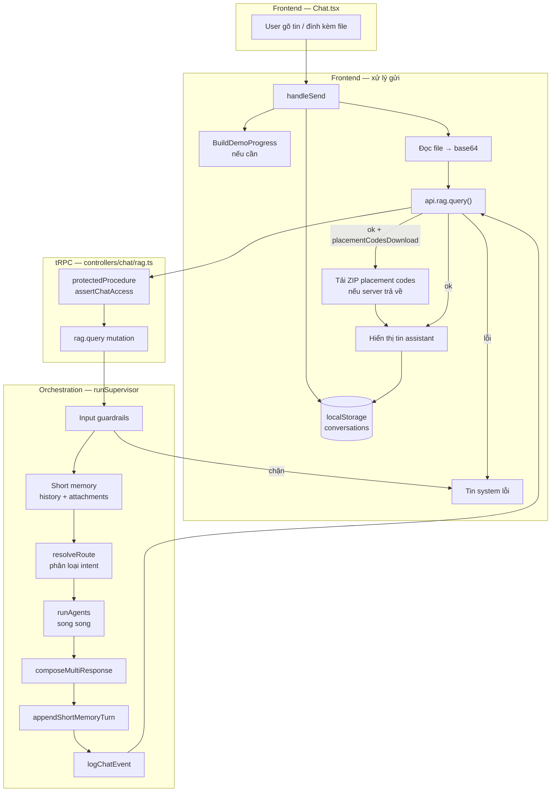
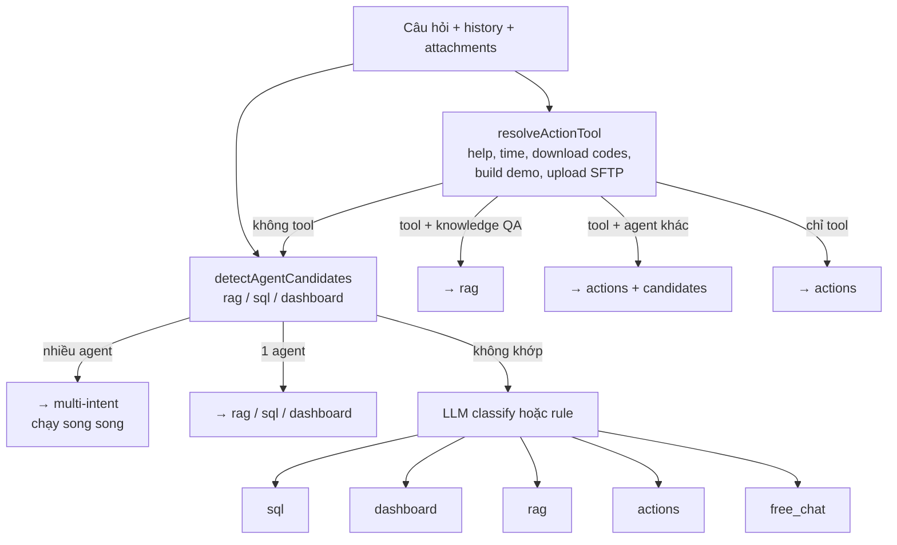
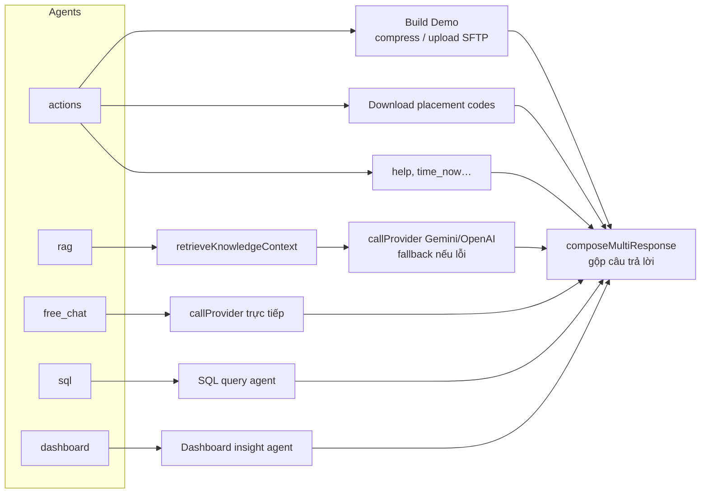
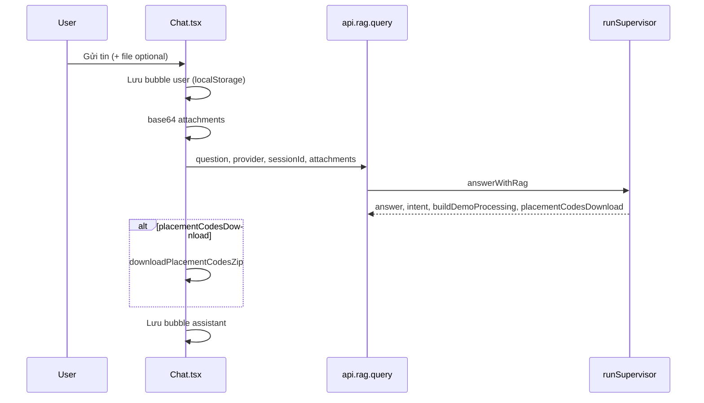
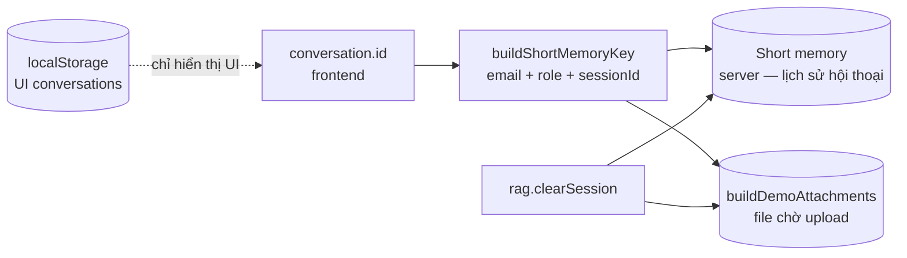
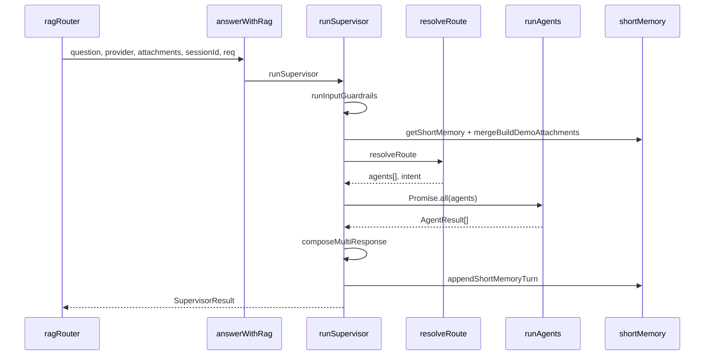

# Chat — Sơ đồ luồng

**YoMedia Dashboard · NovaAI Assistant**  
*Tài liệu sơ đồ · Cập nhật: 2026-06-09*

> Chi tiết đầy đủ (agents, Build Demo, API, debug): [`chat-agent-flow.md`](./chat-agent-flow.md)  
> Kiến trúc Build Demo: [`server-build-demo-architecture.md`](./server-build-demo-architecture.md)

---

## 1. Tổng quan end-to-end

Mọi tin chat đi qua **một endpoint** `rag.query` (tRPC). Frontend không gọi LLM trực tiếp.

### File chính

| Lớp | File |
|-----|------|
| UI | `apps/web/components/Chat.tsx` |
| API client | `apps/web/lib/trpc/api.ts` |
| tRPC router | `apps/server/src/controllers/chat/rag.ts` |
| Entry orchestration | `apps/server/src/lib/ai/orchestration/answerWithRag.ts` |
| Supervisor | `apps/server/src/lib/ai/agents/supervisor/runSupervisor.ts` |

---

## 2. Phân luồng intent (`resolveRoute`)

**Ghi chú:** Nếu user đang trong phiên Build Demo nhưng câu hỏi là Knowledge QA (scoring ≥ ngưỡng RAG) → router ưu tiên **rag** thay vì actions.

---

## 3. Các agent backend

---

## 4. Luồng gửi tin (Frontend)

| Bước | Hành động |
|------|-----------|
| 1 | User submit → tạo bubble `user`, cập nhật state |
| 2 | Nếu heuristic Build Demo → hiện `BuildDemoProgress` (progress giả lập) |
| 3 | File đính kèm → `readFileAsDataUrl` → `contentBase64` |
| 4 | Gọi `api.rag.query(question, provider, attachments, sessionId)` — `sessionId` = `conversation.id` |
| 5 | Nếu response có `placementCodesDownload` → `downloadPlacementCodesZip` trên client |
| 6 | Thêm bubble `assistant`; lưu vào `localStorage` (`yomedia.chat.conversations.v1`) |
| 7 | Lỗi → bubble `system` qua `handleApiError` |

---

## 5. Session & memory

UI và ngữ cảnh LLM trên server **tách biệt**. Refresh trang hoặc xóa bubble không tự xóa short memory server.

| Loại | Nơi lưu | Mục đích |
|------|---------|----------|
| Conversations | `localStorage` | UI, tối đa 30 hội thoại |
| Short memory | Server RAM | Context LLM (8 turn, TTL 2h) |
| Build Demo files | Server `buildDemoAttachments` | File nhiều lượt trước khi upload |

**Xóa phiên:** reset messages trên UI + `api.rag.clearSession({ sessionId })`.

---

## 6. Sequence server (tóm tắt)

---

## 7. Điểm cần nhớ

1. **Supervisor pattern:** guardrails → route intent → chạy agent(s) song song → gộp response → log.
2. **Ưu tiên action vs RAG:** câu hỏi kiến thức trong phiên Build Demo vẫn có thể route vào `rag`.
3. **Provider:** user chọn Gemini/OpenAI; agent fallback sang provider còn lại nếu lỗi.
4. **Side effects:** Build Demo (SFTP) và download placement codes xử lý ở agent `actions`; frontend chỉ hiển thị progress / tải ZIP.
5. **Progress bar:** heuristic client (`buildDemoChatProgress.ts`) — không phản ánh chính xác tiến độ SFTP; tin cậy field `buildDemoProcessing` từ server.

---

*Tài liệu đồng bộ với codebase YoMedia Dashboard · Cập nhật 2026-06-09*
