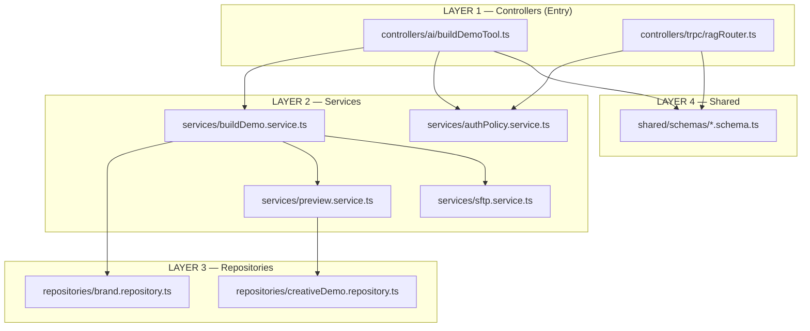
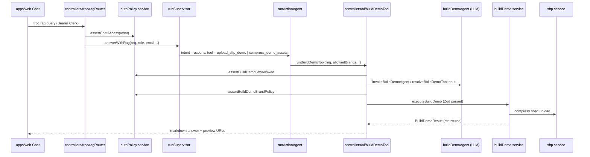
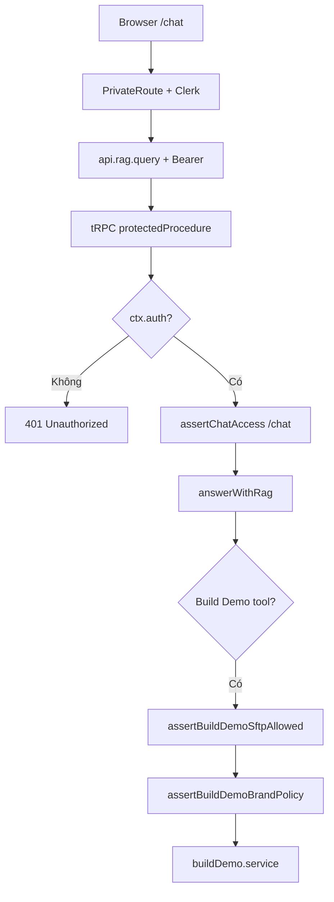

# Server — Build Demo & Chat Architecture

Tài liệu mô tả cấu trúc thư mục và luồng xử lý **Build Demo qua Chat** trên `apps/server`, sau refactor 4 lớp (Controller → Service → Repository → Shared).

> Luồng Supervisor / routing / agents: [`chat-agent-flow.md`](./chat-agent-flow.md)

---

## 1. Tổng quan 4 lớp



| Lớp | Trách nhiệm | Không làm |
|-----|-------------|-----------|
| **Controller** | Zod validate, auth/policy, gọi service, format response (markdown / JSON) | SFTP, nén file, logic DB |
| **Service** | Luồng nghiệp vụ: normalize → compress → upload → preview | Không biết tRPC / OpenAI |
| **Repository** | Đọc/ghi data (JSON file hiện tại) | Không validate HTTP |
| **Shared** | Zod schema + types dùng chung | Không import Express / tRPC |

---

## 2. Cấu trúc thư mục

```
apps/server/src/
│
├── controllers/                    # LAYER 1 — cổng vào (toàn bộ API)
│   ├── ai/
│   │   └── buildDemoTool.ts        # Chat: agent args → validate → service → markdown
│   ├── trpc/                       # tRPC procedures
│   │   ├── health.ts, auth.ts, user.ts, permissions.ts, admin.ts
│   │   ├── creative.ts, activityLog.ts, testData.ts, toolTest.ts
│   │   └── ragRouter.ts            # rag.query, rag.clearSession
│   └── rest/                       # Express REST (binary/streaming)
│       ├── sftp.ts, upload.ts, fileUpload.ts, smtp.ts
│
├── trpc/                           # tRPC infra (không phải entry)
│   ├── appRouter.ts                # Gộp controllers/trpc/*
│   ├── trpc.ts                     # procedures, middleware
│   └── context.ts
│
├── services/                       # LAYER 2 — business logic
│   ├── buildDemo.service.ts        # Orchestrator chính + formatBuildDemoChatAnswer
│   ├── authPolicy.service.ts       # /chat route, brand ACL, SFTP ACL
│   ├── preview.service.ts          # URL preview demo.yomedia.vn
│   ├── sftp.service.ts             # Wrapper lib/sftp
│   └── buildDemo/
│       ├── assets.ts               # Inline ảnh base64, manifest URLs
│       ├── common.ts               # Path, normalize brand, decode attachment
│       ├── compress.ts             # Nén HTML/assets + upload
│       ├── upload.ts               # Upload SFTP trực tiếp
│       ├── inlineImages.ts
│       ├── vastXml.ts              # make-vast.xml cho video demo
│       └── config.ts               # Brand label, filter allowed brands
│
├── repositories/                   # LAYER 3 — data access
│   ├── brand.repository.ts         # demoConfig.json (ListBrands)
│   └── creativeDemo.repository.ts  # creative-demos.json
│
├── shared/schemas/                 # LAYER 4 — Zod validate
│   ├── buildDemo.schema.ts
│   ├── rag.schema.ts
│   └── chatAttachment.schema.ts
│
├── lib/ai/tools/buildDemo/
│   └── buildDemoAgent.ts           # LLM extract args (OpenAI / Gemini) — không upload SFTP
│
└── lib/                            # Infra: sftp, auth/clerk, ai agents, guardrails…
```

---

## 3. Luồng Chat → Build Demo



### Bước validate đầu vào (Controller)

1. **tRPC** — `protectedProcedure` → bắt buộc `ctx.auth` (Clerk Bearer).
2. **ragRouter** — `ragQueryInputSchema` (Zod) + `assertChatAccess(req)` kiểm tra role có route `/chat`.
3. **buildDemoTool** — `buildDemoInputSchema` (Zod) sau khi LLM/heuristic trích args.
4. **buildDemoTool** — `assertBuildDemoSftpAllowed(req)` (`canSftpUploadBinary`).
5. **buildDemoTool** — `assertBuildDemoBrandPolicy(brandId, allowedBrands)`.

Service **chỉ** nhận input đã parse; không đọc `x-user-role` header.

### Supervisor routing (trước khi vào Build Demo)

`runSupervisor` gọi `resolveRoute` (`lib/ai/agents/router/routeIntent.ts`) **trước** `runActionAgent`. Build Demo chỉ chạy khi route chọn agent `actions` và tool là `upload_sftp_demo` / `compress_demo_assets`.

| Ưu tiên | Điều kiện | Kết quả |
|---------|-----------|---------|
| 1a | Tool **và** candidate `rag` | Chỉ **rag** — QA ưu tiên hơn phiên Build Demo |
| 1b | Tool **và** candidates khác | `actions` + candidates (multi_intent) |
| 1c | Chỉ tool | `actions` |
| 2+ | Không tool | scoring / LLM → rag, sql, dashboard, free_chat |

Trong phiên Build Demo, `resolveActionTool` có thể trả `null` nếu câu follow-up đạt `RAG_THRESHOLD` (0.45) — khi đó router không ép actions.

---

## 4. Luồng auth



| Kiểm tra | Frontend | `rag.query` | Build Demo SFTP |
|----------|----------|-------------|-----------------|
| Đăng nhập Clerk | Có | Có | Có (qua tRPC) |
| `allowedRoutes` có `/chat` | Có | Có (`authPolicy`) | — |
| `canSftpUploadBinary` | — | — | Có (`authPolicy`) |
| `allowedBuildDemoBrands` | Một phần UI | — | Có (service normalize) |

---

## 5. Service chính — `buildDemo.service.ts`

### Input (sau Zod)

```ts
{
  toolInput: { brandId, demoFormat, folderName?, formatValue? },
  attachments: ChatAttachmentMeta[],
  allowedBrands: string[] | null,
  intent: "upload_sftp" | "compress_demo_assets"
}
```

### Output (structured)

```ts
// Thành công
{
  ok: true,
  intent, actionLabel, input, relativePath,
  upload: { uploaded, remoteBase, imagesInlined, videoCompressed?, videoFinalBytes? },
  previewUrl, videoPreviews[]
}

// Thất bại
{ ok: false, message: string }
```

Controller gọi `formatBuildDemoChatAnswer(result)` để trả markdown cho Chat.

### Nhánh xử lý

| Format | Intent | Hành động |
|--------|--------|-----------|
| HTML | `compress_demo_assets` | Inline ảnh base64 → upload SFTP |
| HTML | `upload_sftp` | Upload file thô lên SFTP |
| Video | (cả hai) | Nén TVC ≤4MB → `tvc.mp4` + `make-vast.xml` |

---

## 6. Preview URL — `preview.service.ts`

Sinh link `https://demo.yomedia.vn/...?f=&b=&l=&c=demo`:

1. Đọc size từ SFTP folder (`384x683.js`) hoặc path.
2. Tra `creative-demos.json` → chọn format (`f=`).
3. HTML → site `idmb` / `idpc`; Video → `idvd` + `make-vast.xml`.

Video demo trả **2 link**: In-read (`outstream`) + Pre-roll (`instream`).

---

## 7. File còn lại vs đã gỡ

### Giữ (production)

| File | Vai trò |
|------|---------|
| `controllers/ai/buildDemoTool.ts` | Cổng Chat build demo |
| `controllers/trpc/ragRouter.ts` | Cổng Chat RAG |
| `services/buildDemo.service.ts` | Orchestrator |
| `services/buildDemo/*` | Upload, compress, assets, VAST |
| `services/preview.service.ts` | Preview URL |
| `services/authPolicy.service.ts` | Policy layer |
| `repositories/brand.repository.ts` | Brands từ demoConfig |
| `repositories/creativeDemo.repository.ts` | Catalog creative-demos |
| `shared/schemas/*` | Zod schemas |
| `lib/ai/tools/buildDemo/buildDemoAgent.ts` | LLM extract tham số |

### Đã gỡ (không còn trong repo)

- Shim re-export: `lib/buildDemoBrands.ts`, `buildDemoShared.ts`, `buildDemoPreviewUrl.ts`, `buildDemoAssets.ts`, `lib/ai/tools/buildDemo/*` (trừ `buildDemoAgent.ts`).
- Không dùng: `lib/chatDemoCommands.ts`, `lib/testGeneratePreviewUrl.ts`.
- Thư mục cũ: `trpc/routers/`, `routes/` (đã gộp vào `controllers/trpc/`, `controllers/rest/`).
- Page web Build Demo đã gỡ; build demo **chỉ qua Chat**.

---

## 8. API endpoints liên quan

| Endpoint | Layer | Mô tả |
|----------|-------|-------|
| `POST /api/trpc/rag.query` | Controller | Gửi câu hỏi Chat (+ attachments) |
| `POST /api/trpc/rag.clearSession` | Controller | Xóa short-memory session |
| `POST /api/sftp/*` | REST (Manage Demo UI) | SFTP có ACL riêng; **không** dùng cho Chat build demo |

Chat build demo gọi **trực tiếp** `sftp.service` từ server process, không qua REST `/api/sftp`.

---

## 9. Phase tiếp theo (chưa làm)

- `controllers/trpc/buildDemoRouter.ts` — API manual khi có consumer (page/script).
- Chuyển `creative-demos` / `accounts` sang DB khi có Prisma — chỉ đổi repository, service giữ nguyên.
